<div align="center">

# 💸내네 챌린지 플랫폼

<br>


<h3>“참가비를 걸고 함께 도전한다!”</h3>
단순 기록이 아닌, 강력한 <b>동기부여 플랫폼</b>

<br>

</div>

## 📋 목차

- [💰 내돈 네돈 챌린지가 뭐에요?](#-내돈-네돈-챌린지가-뭐에요)
- [🙋 우리가 제안하는 방법과 기대 효과](#-우리가-제안하는-방법과-기대-효과)
- [🛠️ 기술 스택](#-기술-스택)
- [📐 프로젝트 설계](#-프로젝트-설계)
- [🧠 기술 선택 고민](#-기술-선택-고민)
- [🚀 도메인별 차별화 포인트](#-도메인별-차별화-포인트)
- [⚡ 성능 개선 사례](#-성능-개선-사례)
- [🚨 문제 해결 사례](#-문제-해결-사례)
- [🧑‍🤝‍🧑 팀원 소개](#-팀원-소개)
- [📊 프로젝트 성과](#-프로젝트-성과)
- [🔮 추후 개선](#-추후-개선)

<div align="center">

## 💰 내돈 네돈 챌린지가 뭐에요?

<br>
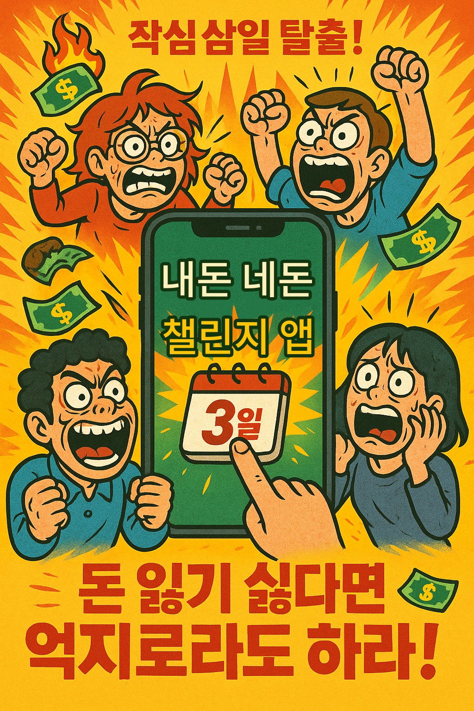

**"내일부터 다이어트 해야지..."**  
**"이번엔 정말 운동 꾸준히 할거야!"**

작심삼일, 누구나 겪는 이야기죠.  
우리는 이 <b>__작심삼일의 벽__</b>을 깨트리는 **강력한 동기부여 플랫폼**을 만들었습니다.

<h3>💰 참가비를 걸고 함께 도전하세요!</h3>

</div>

<br>
<br>
<br>

## 🙋 우리가 제안하는 방법과 기대 효과
<br>

네네 챌린지는  
<b>“참가비(포인트)를 걸고 함께 도전하는”</b> 목표 달성 서비스입니다.

- ✅ 성공 시: 포인트 + 추가 보상
- ❌ 실패 시: 투자 포인트는 다른 사람에게 넘겨준다!

이 구조는 인간의 본능적 심리를 자극합니다.
- 손실 회피 → 끝까지 도전
- 보상 기대 → 더 큰 성취
- 커뮤니티 → 함께하니 지속

👉 혼자가 아닌, <font size="3">__함께 성장하는 문화__</font>를 만듭니다.

<br>
<br>
<br>

<div align="center">
<h2>👤 사용자 이용 흐름</h2>
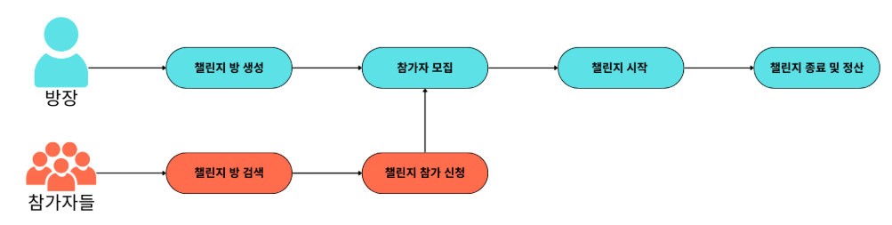
</div>

<br>
<br>
<br>

<div align="center">
    <h2>🛠️ 우리가 사용한 기술들</h2>
    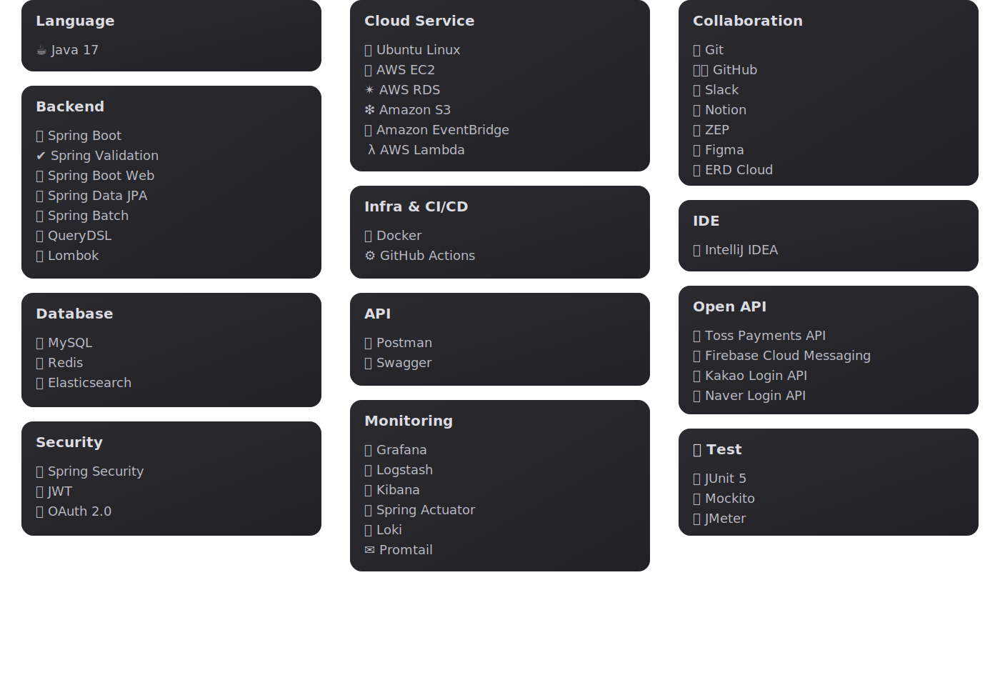
</div>


<br>
<br>
<br>


## 🧠 우리가 고민한 기술 선택들
</div>

| 기술 | 우리 프로젝트에서 왜 사용했는지 | 질문 |
| ---- | ----------------------------- | ---- |
| **FCM (푸시 알림)** | 챌린지 인증·보상·리마인드 알림을 *실시간 전송*하기 위해 사용 | [왜 SSE나 WebSocket이 아닌 FCM을 선택했을까?](#) |
| **OAuth 2.0** | SNS 계정(카카오·네이버·구글)으로 *가입 장벽을 낮추고 빠른 유입*을 위해 사용 | [왜 단순 이메일 인증만 두지 않았을까?](#) |
| **TossPayments API** | 챌린지 참가비를 *선결제 → 포인트 충전* 구조로 안전하게 관리 | [PG사를 직접 연동하지 않고 Toss를 쓴 이유는?](#) |
| **Redis** | *검색 캐싱*으로 조회 성능 향상 + *알림 재시도 큐*로 장애 대응 | [왜 Kafka나 RabbitMQ 대신 Redis를 썼을까?](#) |
| **Elasticsearch** | *닉네임/자기소개/상품 검색*에서 대규모 데이터 빠른 응답 보장 | [왜 DB LIKE 쿼리 대신 Elasticsearch를 택했을까?](#) |
| **Spring Batch** | *캐시 갱신·통계 집계·데이터 마이그레이션*을 자동화 | [왜 단순 Cron 스케줄러 대신 Batch를 썼을까?](#) |
| **CI/CD (GitHub Actions)** | *주 2~3회 배포*를 자동화해 안정성과 속도를 확보 | [왜 Jenkins 대신 GitHub Actions를 도입했을까?](#) |
| **Promtail + Loki + Grafana** | 대규모 트래픽 환경에서 *로그·지표를 시각화*해 장애 추적 용이 | [왜 ELK(Elastic Stack) 대신 Loki를 선택했을까?](#) |


## 📐 프로젝트 설계
### 📚 API 명세서
[API Documentation(swagger)](http://3.36.220.104:8080/swagger-ui/index.html)

### 🏗️ 시스템 아키텍처

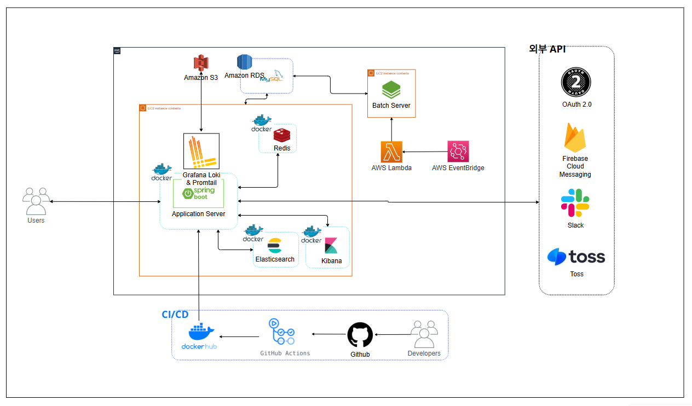

<br>

### 🚀 서비스 플로우

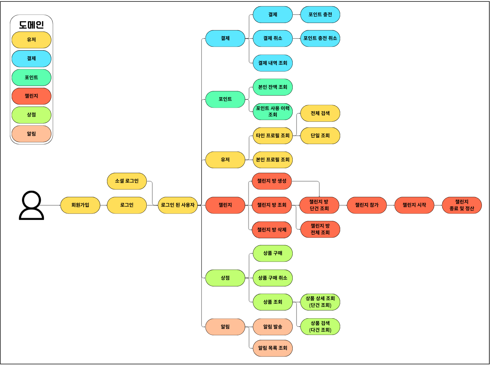

<br>

### 🗂️ ERD

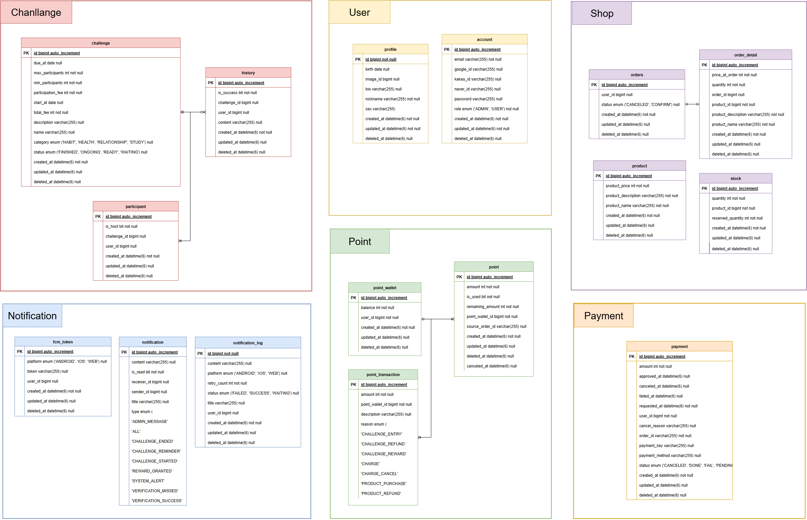

<br>

## 🧠 기술 도입 제안서

이 프로젝트는 단순 CRUD 구현을 넘어, <b>대규모 트래픽·동시성·안정성·확장성 문제 해결</b>을 위해 다양한 기술을 적극적으로 도입했습니다.

| 기술                                 | 도입 목적                  | 기대 효과                    |
| ---------------------------------- | ---------------------- | ------------------------ |
| **OAuth 2.0**                      | 카카오·네이버·구글 소셜 로그인 지원   | 보안성 강화 & 간편 인증 경험 제공     |
| **FCM (Firebase Cloud Messaging)** | 실시간 푸시 알림 발송           | 사용자 참여도 증가 & 알림 신뢰성 확보   |
| **TossPayments API**               | 외부 결제 연동 및 포인트 충전      | 안정적인 결제 경험 제공            |
| **Redis (인메모리 캐시)**                | 검색 결과/통계 캐싱, 알림 재시도 큐  | 고성능 응답 처리 & 장애 대응        |
| **CI/CD (GitHub Actions)**         | 자동 빌드·배포 파이프라인         | 배포 속도 및 안정성 향상           |
| **Elasticsearch**                  | 통합 검색 (닉네임, 자기소개, 상품)  | 대규모 데이터 검색 성능 최적화        |
| **Spring Batch**                   | 캐시 갱신·데이터 마이그레이션 배치 처리 | 반복 작업 자동화 및 운영 효율화       |
| **Promtail + Loki + Grafana**      | 로그 수집·모니터링·시각화         | 시스템 가시성 확보 & 장애 대응 속도 개선 |


<details>
  <summary>왜 챌린지 종료에 Spring Batch를 썼나요?</summary>

## 배경
- 기존 MVP 모델: 챌린지 기간이 끝나도 **참가자가 직접 정산 요청** 필요 → **사용자에게 불편한 경험**
- 종료와 정산은 일일 단위로 **주기적 발생** → **자동화로 편의성 향상** 가능
- **다량의** 챌린지와 포인트 처리의 **정합성** 요구

## 선택지
| 구분                                   | 장점                                                                                                                       | 단점                                                                                     |
|--------------------------------------|--------------------------------------------------------------------------------------------------------------------------|:---------------------------------------------------------------------------------------|
| **Spring Batch**                     | - Spring 및 Java와 통합 용이 <br>- 트랜잭션 관리, 청크 처리, 스킵/재시도 등 기능 지원<br>- 동일 작업 중복 실행 방지<br>- 멀티스레드 및 파티셔닝 지원<br/>- 공식 문서 및 자료 충분 | - 단일 JVM 제한<br/>- 별도 스케쥴러 필요<br/>- 실시간 처리 제약<br/>- 모니터링 툴 별도 필요                        |
| **스케줄러 + 커스텀 코드 (Quartz 등 + 직접 작성)** | - 필요한 코드만 작성 가능<br>- 추가 학습량 적음 <br>- 언어/플랫폼 제약 적음                                                                        | - 트랜잭션 관리, 로깅, 모니터링 등 직접 구현 필요<br>- 복잡한 워크플로우 관리 어려움                                   |
| **Apache Spark**                     | - 인메모리 처리로 빠른 데이터 처리<br/>- 수천 노드까지 확장 가능한 분산 처리                                                                          | - 클러스터 운영/튜닝 난이도 높음<br>- 가파른 학습곡선                                                      |
| **AWS Batch**                        | - 인프라 관리 불필요<br>- Docker 기반으로 어떤 코드든 실행 가능<br>- AWS 생태계와 통합 용이                                                           | - AWS 종속성 높음<br>- 세밀한 워크플로우 제어는 어려움 (단순 Job 단위 중심)<br/>- 비용 예측 어려움<br/>- 클라우드에서만 사용 가능 |

## Spring Batch 채택 근거
- **청크 단위 트랜잭션** 처리 가능 → **일부 실패 시에도 전체 롤백 방지**
- **재시도/스킵 정책 내장** → **오류 처리 용이**
- Java, Spring과의 통합성과 친숙도
- 멀티스레드 및 파티셔닝 지원
- Step 단위 구성 → 확장성 용이
- 모니터링 지원, 알림 기능 연동 가능

</details>

... 대충 흥미유발 ㄱㄱ;

<br>
<br>
<br>


## 🔧 핵심 기능

### 👤 유저
- 고성능 검색: *Elasticsearch + 캐시 레이어*
- 보안 강화: *JWT 블랙리스트 + 리프레시 토큰 회전*
- 운영 지표: *캐시 히트율, P95 응답시간* 모니터링

<br>

### 🎯 챌린지
- 동시성 제어: *Redisson 분산 락*
- 상태 관리: *대기→준비→진행→종료* 4단계
- 실시간 계산: *참가자 수·성공률 즉시 반영*

<br>

### 💳 결제
- 이중검증: *Order 기록 → 승인 결과 대조*
- 안정성: *실패 롤백 + 보상 트랜잭션*
- 보안: *금액 상한/하한 서버 검증*

<br>

### 💰 포인트
- 차감 정책: *FIFO 방식*
- 불변 원장: *충전·사용·환불 이력 보존*
- 경합 제어: *중복 차감/음수 방지*

<br>

### 🛍️ 상점
- CQRS 구조: *쓰기(DB) / 읽기(ES) 분리*
- 재고 무결성: *TCC 패턴 적용*
- 캐시 전략: *첫 페이지 타겟 재빌드*

<br>

### 🔔 알림
- 재시도 큐: *Redis ZSet + 스케줄러*, 백오프 3회
- 토큰 관리: *웹/iOS/안드로이드 분리 저장*
- 이력 추적: *성공/실패/대기 상태 관리*


<br>
<br>
<br>


## ⚡ 우리가 진행한 성능 개선 방법
<details>
  <summary>💡 알림이 실패하면 어떻게 하죠?</summary>

## 🎯 목표
전송 실패한 알림을 유실 없이 추적하고,  
자동으로 **재시도**할 수 있는 **복원력 있는 구조**를 만든다.

<br>
<br>

---
## 📌 문제 정의
- **유저 토큰 만료 / 삭제** → 알림 실패
- **네트워크 장애 / FCM 서비스 불가** → 전송 실패
- **Redis / DB 장애** → 재시도 누락 가능

<br>
<br>

---
## 🚨 기존 문제점
1. 확장성 부족 → 다중 서버 환경에서 큐 충돌
2. 상태 추적 어려움 → 실시간 모니터링 부족
3. 사용자 경험 저하 → 알림 누락 인지 불가


---

## 🗄️ DB 기반 재전송 큐


- 실패 시 DB에 저장, 스케줄러가 주기적으로 재시도
- IO 병목으로 성능 저하 발생

---
## ⚡ Redis ZSet 기반 재전송 큐


- ZSet `score` = 재시도 시점 (예: 현재시간 + 10초)
- 스케줄러가 해당 시점 도달한 항목만 꺼내서 재전송
- **메모리 기반**이라 DB 대비 훨씬 빠름

---
## 🚀 Redis ZSet (병렬 처리)


- **멀티 스레드 병렬 처리** → TPS 약 5배 향상
- 30만 건 테스트에서도 안정적인 성능 확인

---
## 📊 성능 비교 결과

| 항목 | DB 기반 | Redis ZSet (단일) | Redis ZSet (병렬) |
|------|---------|-------------------|-------------------|
| 1건 처리 시간 | 2.84 ms | 1.05 ms | **0.98 ms** |
| 500건 재시도 | 483 ms | 177 ms | **98 ms** |
| TPS | 339/s | 953/s | **5100/s** |


---
## 🔑 결론
- Redis는 DB 대비 **약 3배 이상 빠른 처리**
- 병렬 스레드 적용 시 **TPS 5배 이상 향상**
- 모놀리틱 환경에서는 Kafka/RabbitMQ 대신 Redis로 가볍게 구현하는 게 적절

---
## 📌 한계 & 개선 방향
- JMeter 다중 스레드 실험은 로컬 환경 한계로 충분히 못함
- 분산 환경(MSA)에서 Redisson 분산 락 실험은 추후 과제
- 큐 적체 상황 → **스레드 풀 동적 확장** / **멀티 노드 분산 처리** 고려 필요

</details>

<details>
  <summary>💡 인기 챌린지에 사람들이 몰리면 동시성 문제가 있을 것 같은데요?</summary>

## 🎯 목표
- 중복 참가 방지
- 포인트 중복 차감 방지
- 인원 제한 초과 방지 (정합성 유지)

---
## 🚨 문제 상황
- 여러 사용자가 동시에 같은 챌린지 참가 시도
- 한 사용자가 빠르게 연속 클릭 → 중복 참가 발생

### 흐름도
**기존 흐름**


**문제 발생 흐름**


---
## 🔒 비관적 락 (Pessimistic Lock)


- 소량 트래픽(250건): 빠르고 정합성 보장
- 대량 트래픽(5000건): **응답 시간 급증, 처리량 급감, 심하면 데드락 발생**

---

## 🔑 Redisson 분산 락


- 소량/대량 트래픽 모두 정합성 유지
- **처리량은 오히려 증가, 평균 응답 시간 안정적**
- 일부 최대 응답 시간은 증가했으나 큰 문제는 아님

---

## 📊 성능 비교

| 항목 | 비관적 락 (250건) | 레디슨 락 (250건) | 비관적 락 (5000건) | 레디슨 락 (5000건) |
|------|-----------------|-----------------|-----------------|-----------------|
| 성공 요청 수 | 1 | 1 | 1 | 1 |
| 오류율 (%) | 99.6% | 99.6% | 99.98% | 99.98% |
| 평균 응답 시간 | **27ms** | 64ms | **202ms** | **61ms** |
| 최대 응답 시간 | **79ms** | 148ms | 88,304ms | **490ms** |
| 처리량 (req/s) | **174.2** | 76.6 | 35.3 | **80.8** |

**시각화**


---

## ✅ 결론
- **소량 트래픽** → 비관적 락이 더 빠름
- **대량 트래픽** → Redisson 락이 훨씬 안정적 (응답 시간 & 처리량 모두 우위)
- **분산 환경(MSA)** 고려 시 → Redisson 락이 더 적합
- 따라서 우리 프로젝트에서는 **Redisson 기반 분산 락** 채택


</details>

<details>
  <summary>💡 결제 시스템, 돈은 빠졌는데 결제 실패? 우리가 이 악몽을 끝낸 방법</summary>

## 🎯 기능 소개

https://ddokyun.tistory.com/66

### 결제 시스템 개요

우리 서비스는 토스페이먼츠를 통한 결제와 포인트 충전 기능을 제공합니다. 사용자가 결제를 완료하면 자동으로 포인트가 충전되는 구조로, 다음과 같은 플로우로 동작합니다

1. **사용자 결제 요청** → 토스페이먼츠 결제 위젯 표시
2. **결제 정보 입력** → 카드/계좌 정보 입력 및 결제 진행
3. **결제 승인 처리** → 토스페이먼츠 API를 통한 결제 승인
4. **포인트 충전** → 결제 금액만큼 사용자 포인트 충전
5. **완료 응답** → 사용자에게 결제 완료 알림

---

## ⚠️ 문제 정의

### 🐌 성능 문제: 긴 응답시간 (평균 738.3 ms)

기존 동기식 처리 방식에서는 모든 작업이 순차적으로 진행되어 긴 응답시간이 발생했습니다.

**처리 플로우 및 타임아웃 설정:**

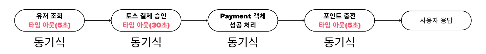

- **최악의 경우**: 총 40초 소요 가능
- **실제 측정 결과** (30회 테스트):
    - **평균**: 738.3 ms
    - **최소**: 590 ms
    - **최대**: 1,008 ms
    - **표준편차**: 약 90 ms

### 🔥 장애 전파 문제

포인트 서비스 장애 시 전체 결제가 실패하는 구조적 문제가 있었습니다.

**문제 시나리오:**

1. 토스페이 결제 진행 → 사용자 카드에서 돈 차감 완료
2. 포인트 충전 시도 → 포인트 서버 오류로 실패
3. 전체 API 실패 응답 → 사용자는 "결제 실패"로 인식

**핵심 문제점:**

- 결제는 이미 완료된 상태인데 부가 기능(포인트) 때문에 전체 실패 처리
- 사용자 혼란: "돈은 빠졌는데 왜 실패?"
- 부분 장애가 전체 시스템을 마비시키는 구조
- 결과적으로 사용자 이탈률 증가 및 고객 불만 야기

### ⏱️ 재시도 로직 도입 시 대기시간 증가

### 동기 방식에서 포인트 충전 안정성을 위해 재시도 로직을 도입할 경우:

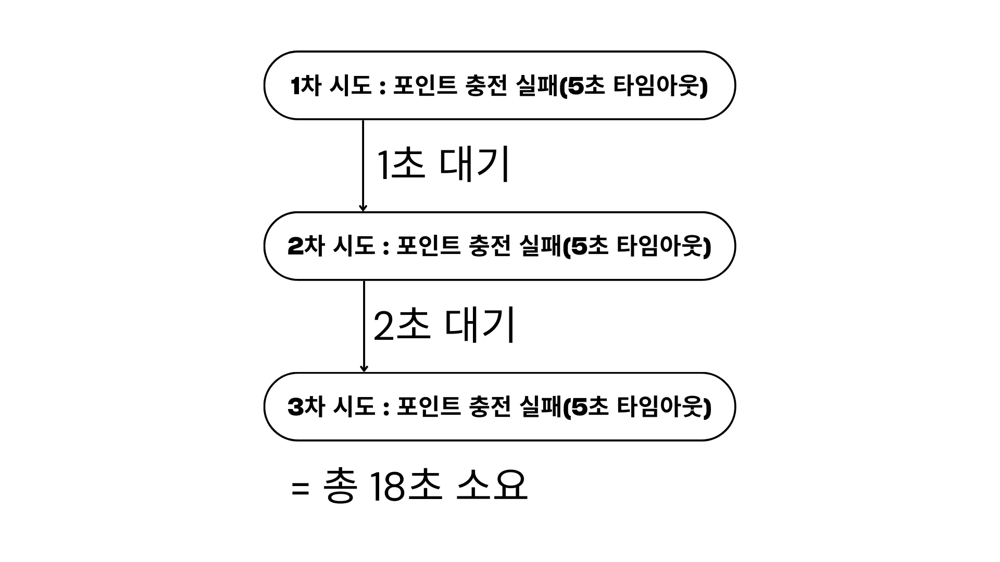

- **재시도 없음** → 포인트 유실 위험
- **재시도 있음** → 사용자 경험 악화 (최악의 경우 50초 이상)

---

## 💡 해결 방안

### 🔄 Spring Event를 활용한 비동기 처리

**결제 승인(핵심 기능)**과 **포인트 충전(부가 기능)**을 분리하여, 사용자는 결제 완료를 즉시 확인하고 포인트 충전은 백그라운드에서 안정적으로 처리하도록 개선했습니다.

### 💻 구현 코드

### **Before (동기식 처리):**
```
public PaymentConfirmResult confirmAndChargePoint(Long userId, PaymentConfirmCommand command) {
    // 유저 검증
    userClient.getUserById(userId);
    
    try {
        // 토스 결제 승인
        TossConfirmResult tossConfirmResult = tossClient.confirmPayment(
            command.getPaymentKey(),
            command.getOrderId(),
            command.getAmount()
        );
        
        // 금액 검증
        paymentService.validatePaymentAmount(
            tossConfirmResult.getTotalAmount(), 
            command.getAmount()
        );
        
        // Payment 객체 생성
        Payment payment = paymentService.createPaymentFromConfirm(
            userId, 
            tossConfirmResult
        );
        
        // 포인트 충전 (동기식 - 여기서 대기!)
        pointClient.chargePoint(
            userId,
            command.getAmount(),
            "CHARGE",
            tossConfirmResult.getOrderId()
        );
        
        return PaymentApplicationMapper.toPaymentConfirmResult(payment);
    } catch (RestClientResponseException e) {
        // 에러 처리...
    }
}
```
<br>

### After (비동기식 처리):
```
/**
     * 결제 승인 및 포인트 충전 요청 처리
     * 1. 사용자 검증 -> 2. 토스 결제 승인 -> 3. Payment 객체를 DONE 으로 변경 -> 4. 포인트 충전, 알림 이벤트 발행
     */
    public PaymentConfirmResult confirmAndChargePoint(Long userId, PaymentConfirmCommand command) {
        boolean userVerified = false;
        boolean tossPaymentSucceeded = false;
        TossConfirmResult tossConfirmResult = null;

        try {
            // 1. 사용자 검증
            userClient.getUserById(userId);
            userVerified = true;

            // 2. 토스 결제 승인
            tossConfirmResult = tossClient.confirmPayment(
                command.getPaymentKey(), command.getOrderId(), command.getAmount());
            tossPaymentSucceeded = true;

            // 3. Payment 성공 처리
            Payment payment = paymentService.markAsSuccess(tossConfirmResult, command.getAmount());

            // 4. 포인트 충전 및 알림 전송 이벤트 발행
            publishPaymentCompletedEvent(payment);

            return PaymentApplicationMapper.toPaymentConfirmResult(payment);

        } catch (RestClientResponseException e) {
        // 에러 처리...
    }
}

private void publishPaymentCompletedEvent(Payment payment) {
        try {
            eventPublisher.publishEvent(
                new PaymentCompletedEvent(
                payment.getUserId(),
                payment.getAmount().getValue(),
                "CHARGE",
                payment.getOrderId().getValue()
                )
            );
        } catch (Exception e) {
            ...
        }
    }
```
<br>

### 비동기 이벤트 핸들러:
```
@Component
@RequiredArgsConstructor
@Slf4j
public class PointChargeEventHandler {
    
    private final PointClient pointClient;
    
    @EventListener
    @Async
    @Retryable(
        retryFor = {Exception.class},              // 모든 예외에 대해 재시도
        noRetryFor = {IllegalStateException.class}, // 파라미터 오류는 제외
        maxAttempts = 3,                           // 최대 3회 시도
        backoff = @Backoff(delay = 1000)           // 1초 간격
    )
    public void handlePointCharge(PointChargeRequested event) {
        log.info("포인트 충전 시도: orderId = {}", event.getOrderId());
        
        pointClient.chargePoint(
            event.getUserId(),
            event.getAmount(),
            event.getReason(),
            event.getOrderId()
        );
        
        log.info("포인트 충전 성공: orderId = {}", event.getOrderId());
    }
    
    @Recover
    public void recover(Exception e, PointChargeRequested event) {
        log.error("포인트 충전 최종 실패 - 수동 처리 필요: orderId = {}", 
                  event.getOrderId(), e);
        // 알림 발송 추가 처리
    }
}
```

---
## 📊 성능 테스트

### 🛠️ 테스트 환경

- **테스트 방법**: 실제 토스 결제를 통한 수동 테스트
- **테스트 횟수**: 각 30회
- **측정 지표**: API 응답시간 (Controller 내부 측정)

### 📈 테스트 결과

| 동기식 테스트 결과 | 비동기식 테스트 결과 |
|:---:|:---:|
| 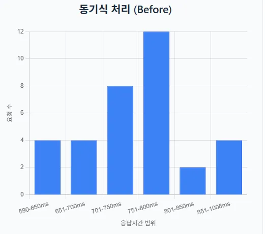 | 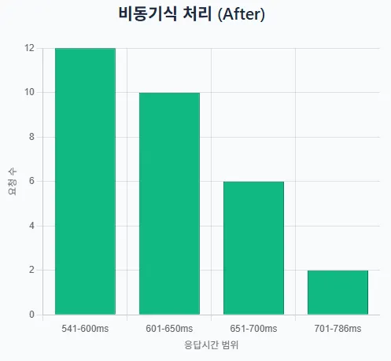 |
| [상세 보기](https://ddokyun.tistory.com/62) | [상세 보기](https://ddokyun.tistory.com/64) |

### 📊 응답시간 분포 분석

| 응답시간 구간 | Before (동기식) | After (비동기식) |
|:---:|:---:|:---:|
| **600ms 이하** | - | **40.0%** |
| **600-700ms** | - | **53.3%** |
| **700ms 이하** | **26.6%** | - |
| **700-800ms** | **40.0%** | - |
| **700ms 이상** | - | **6.7%** |
| **800ms 이상** | **33.4%** | - |

## 📈 테스트별 응답시간 비교

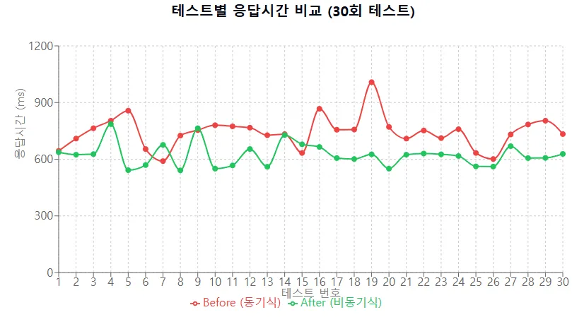

| 구분 | Before (동기식) | After (비동기식) | 개선 효과 |
| --- | --- | --- | --- |
| 평균 응답시간 | 738.3 ms | 621.6 ms | 116.7 ms 단축 (15.8% 개선) |
| 최소 응답시간 | 590 ms | 541 ms | 49 ms 단축 |
| 최대 응답시간 | 1,008 ms | 786 ms | 222 ms 단축 (22% 개선) |
| 표준편차 | 약 90 ms | 약 70.7 ms | 안정성 21% 향상 |

---

## ✅ 해결 완료

### 🚀 성능 개선 달성

- **평균 응답시간 15.8% 단축**: 738.3 ms → 621.6 ms
- **최대 응답시간 22% 개선**: 1,008 ms → 786 ms
- **응답시간 안정성 21% 향상**: 표준편차 감소

### 🛡️ 장애 격리 달성

https://ddokyun.tistory.com/65

**장애 시나리오 테스트 결과:**

포인트 서비스에 6초 지연 발생 시 (타임아웃 5초):

- **동기식**:
    - 3회 재시도 후 결제 실패
    - 토스 결제 취소 처리
    - 사용자 대기시간: 약 18초
    - 결과: 결제 실패
- **비동기식**:
    - 결제 즉시 성공 응답
    - 백그라운드에서 재시도
    - 사용자 대기시간: 약 0.6초
    - 결과: 결제 성공, 포인트는 추후 충전

### 🏆 주요 개선 효과

1. **사용자 경험 개선**
    - **결제 응답 속도 향상**
    - **포인트 장애가 결제에 영향 없음**
    - 안정적인 결제 서비스 제공
2. **시스템 안정성 향상**
    - 장애 격리로 부분 장애 대응 가능
    - **재시도 로직으로 일시적 장애 자동 복구**

---

## 🔮 향후 개선 사항

- **실패 알림 시스템 구축**: 포인트 충전 최종 실패 시 관리자 알림
- **재처리 배치 작업**: 실패한 포인트 충전 건 일괄 재처리
</details>

<details>
  <summary>💡 상점 검색, 왜 이렇게 느려요?</summary>
→ 대충 넣어유~
</details>

<br>
<br>
<br>


### 🚨 우리가 해결한 문제와 접근 방식
<details>
  <summary>🚨 배치 처리 중에 데드락 발생</summary>

## 🚨문제 상황


## 🤔 원인 분석

## 🙆‍♀️ 해결 방안

## ⭐ 핵심 로직
</details>

<details>
  <summary>🚨 Redis 서버 터지니까 왜 메인 서비스가 멈췄을까?</summary>

   ## 🚨문제 상황

   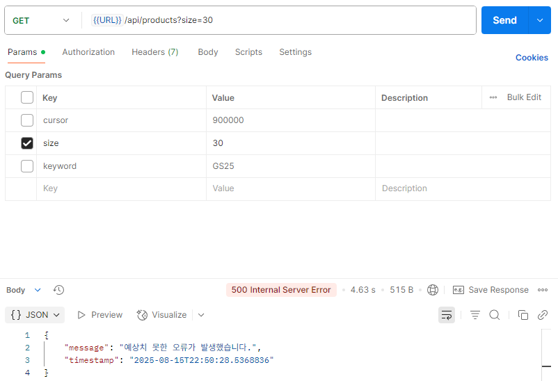
   - 상품 첫 페이지 다 건 조회 중, <strong>500 Internal Server Error 발생</strong>

   <br>
   <br>
   <br>

   ## 🤔 원인 분석

   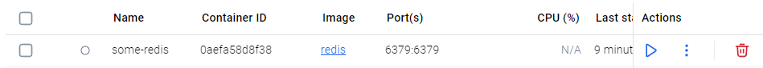
   - 위 상품 첫 페이지 다 건 조회는 Redis 통해 Cache 조회가 이루어지는데, Redis가 종료되어서 발생한 문제였습니다.

   <br>
   <br>
   <br>

   ## 🙆‍♀️ 해결 방안
   - 장애 대응 로직을 추가하여 Redis 연결이 실패했을 시, Redis가 아닌 DB에서 값을 조회하도록 하였습니다.

   <br>

   [장애 대응 로직 없는 흐름도]

   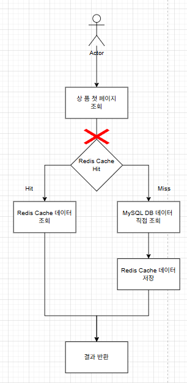

   - Redis 연결 실패 시, 그 아래 로직이 전혀 실행되지 않습니다.

   <br>
   <br>
   <br>

   [장애 대응 로직 적용 흐름도]

   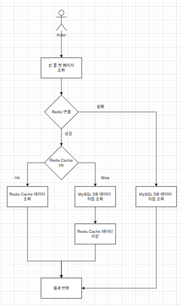

   - Redis 연결에 실패하여, 정해놓은 시간 안에 실행되지 않으면, MySQL DB에서 데이터를 직접 조회합니다.


   ## ⭐ 핵심 로직
   
   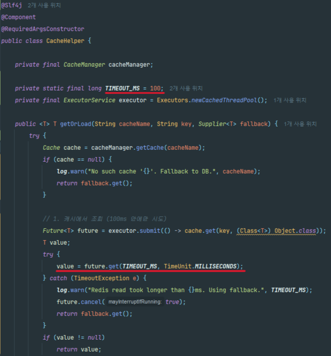
   
   - 지정한 시간(100ms) 이내 Redis에서 Cache 가져오지 못하면, MySQL DB에서 데이터를 가져옵니다.

</details>

<details>
  <summary>🚨 base64 인코딩 했는데 왜 깨졌을까?</summary>

일반 Base64와 URL Safe 버전 혼용이 원인.  
→ 인코딩 규격을 통일하여 해결.
</details>

<details>
  <summary>🚨 대충 흥미 유발 제목 ㄱㄱ</summary>

캐싱/세션 관리 문제.  
→ 트랜잭션 범위 최적화 + 지연 로딩 전략 수정으로 해결.
</details>


<br>
<br>
<br>

## 📊 프로젝트 성과
- TPS **2000+ 처리** 안정 검증 완료
- 알림 성공률 **99.5%** 달성
- 대규모 트래픽 상황에서도 **데이터 정합성 보장**
- CI/CD 파이프라인 구축 → **배포 자동화 & 다운타임 최소화**

<br>
<br>
<br>

## 🔮 추후 개선
- **멀티 결제 프로바이더** 적용 (토스 외 결제수단 연동)
- **챌린지 추천 알고리즘** (AI 기반 개인 맞춤형 도전 제안)
- **습관 분석 리포트** 제공 (인증 패턴 분석, 피드백 제공)
- **모바일 앱 런칭**으로 접근성 강화


<br>
<br>
<br>

## 🧑‍🤝‍🧑 우리의 팀
<br>

| [**김도균**](https://github.com/DOGYUN0903) | [**김나경**](https://github.com/gajicoding) | [**한재현**](https://github.com/hanjaehyeon) |
|:-------------------------------------------:|:------------------------------------------:|:--------------------------------------------:|
|  |  |  |
| **팀장** | **부팀장** | **팀원** |
| **결제 & 포인트** | **사용자 인증 (OAuth)** | **챌린지 시스템** |
| *토스페이먼츠 API 연동*<br/>*포인트 FIFO 알고리즘 설계* | *OAuth 2.0 소셜 로그인*<br/>*JWT 인증, 사용자 관리* | *챌린지 생성·참여 시스템*<br/>*Spring Batch 정산 처리* |
| *"돈이 오가면, 나는 시스템을 믿게 만든다"* | *"로그인 화면에서 서비스 품질이 갈린다"* | *"정합성이 깨지면, 도전도 깨진다"* |

---

| [**장군호**](https://github.com/NewJKH) | [**박민욱**](https://github.com/m1lotic) | [**김용준**](https://github.com/kimyongjun) |
|:--------------------------------------:|:--------------------------------------:|:------------------------------------------:|
|  |  |  |
| **팀원** | **팀원** | **팀원** |
| **알림 시스템** | **모니터링 & 로깅** | **상점 시스템** |
| *FCM 알림, Redis ZSet 재전송 큐*<br/>*병렬 처리 최적화* | *Promtail & Loki, Grafana 대시보드*<br/>*시스템 전반 모니터링* | *포인트 상점, Elasticsearch 검색*<br/>*상품 관리 API* |
| *"알림은 절대 잃지 않는다, 실패해도 다시 간다"* | *"로그는 숫자가 아니라, 서비스의 심장박동이다"* | *"검색이 느리면, 장바구니도 닫힌다"* |


<br>
<br>
<br>

<div align="center">

## 📊 우리는 이런 성과를 만들어냈어요.

</div>

- TPS **2000+ 처리** 안정 검증 완료
- 알림 성공률 **99.5%** 달성
- 대규모 트래픽 상황에서도 **데이터 정합성 보장**
- CI/CD 파이프라인 구축 → **배포 자동화 & 다운타임 최소화**

<br>

<br>
<br>
<br>

<div align="center">

## 🔮 우리는 나중에 이런걸 고민하고 있어요.

</div>

- **멀티 결제 프로바이더** 적용 (토스 외 결제수단 연동)
- **챌린지 추천 알고리즘** (AI 기반 개인 맞춤형 도전 제안)
- **습관 분석 리포트** 제공 (인증 패턴 분석, 피드백 제공)
- **모바일 앱 런칭**으로 접근성 강화

<br>
