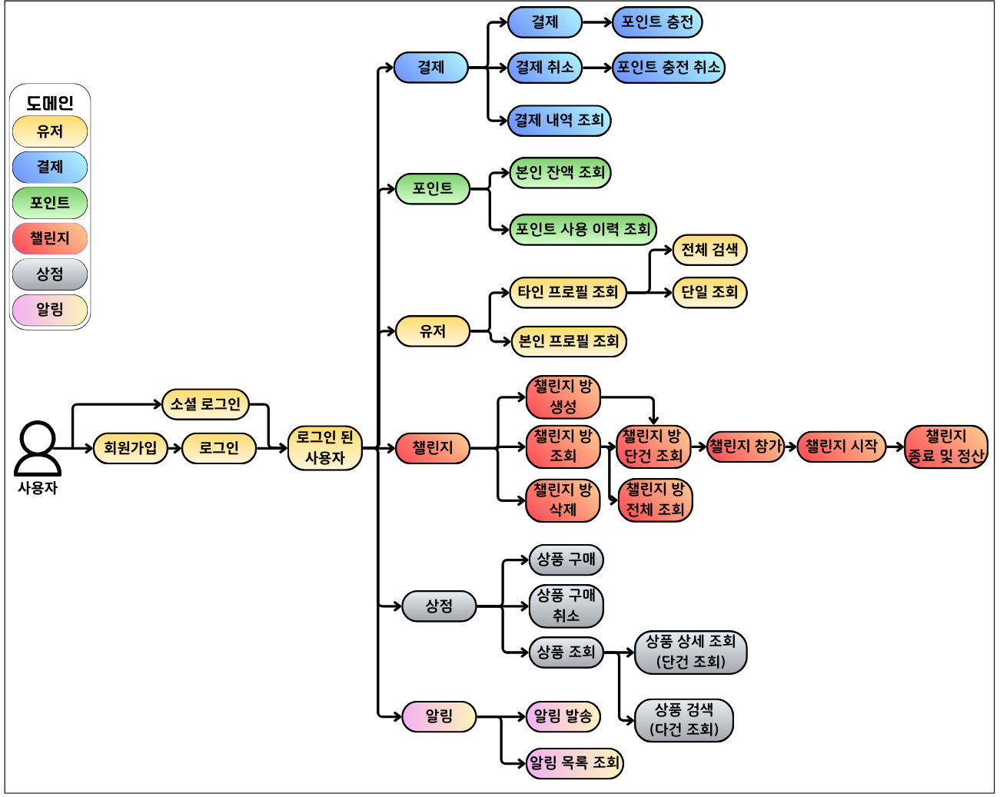

<div align="center">

# 💸내네 챌린지 플랫폼
<br>


<h3>“참가비를 걸고 함께 도전한다!”</h3>
단순 기록이 아닌, 강력한 <b>동기부여 플랫폼</b>

</div>

<br>
<br>


## 📋 목차

- [💰 내돈 네돈 챌린지가 뭐에요?](#-내돈-네돈-챌린지가-뭐에요)
- [🙋 우리가 제안하는 방법과 기대 효과](#-우리가-제안하는-방법과-기대-효과)
- [🛠️ 기술 스택](#-기술-스택)
- [📐 프로젝트 설계](#-프로젝트-설계)
    - [📚 API 명세서](#-api-명세서)
    - [🎨 와이어프레임](#-와이어프레임)
    - [🏗️ 시스템 아키텍처](#-시스템-아키텍처)
    - [🚀 서비스 플로우](#-서비스-플로우)
    - [🗂️ ERD](#-erd)
    - [📦 패키지 구조](#-패키지-구조)
- [🧠 기술을 선택할 때 이런 고민을 했어요!](#-기술을-선택할-때-이런-고민을-했어요)
- [🔧 핵심 기능](#-핵심-기능)
- [⚡ 우리는 성능을 이렇게 개선했어요!](#-우리는-성능을-이렇게-개선했어요)
- [🚨 우리는 문제를 이렇게 해결했어요!](#-우리는-문제를-이렇게-해결했어요)
- [🧑‍🤝‍🧑 팀원 소개](#-팀원-소개)
- [📊 프로젝트 성과](#-프로젝트-성과)
- [🔮 추후 개선](#-추후-개선)
  

<br>
<br>


## 💰 내돈 네돈 챌린지가 뭐에요?

<div align="center">

<br>


“아 내일부터 다이어트해야겠다.”  
“오늘은 나가서 운동해야지.”

하지만 막상 실천은 쉽지 않죠.  
누군가 옆에서 <font size="4">__나를 강제로라도 이끌어줬으면 좋겠다!__</font>
이런 생각, 해본 적 있지 않나요?

우리는 바로 이 <font size="4">__작심삼일의 벽__</font>을 깨기 위해,  
단순 기록이 아닌 <font size="4">__강력한 동기부여 플랫폼__</font>을 만들었습니다.

<br>

</div>

<br>
<br>

## 🙋 우리가 제안하는 방법과 기대 효과
<br>

네네 챌린지는  
<font size="3">__“참가비(포인트)를 걸고 함께 도전하는”__</font> 목표 달성 서비스입니다.

- ✅ 성공 시: 포인트 + 추가 보상
- ❌ 실패 시: 투자 포인트는 다른 사람에게 넘겨준다!

이 구조는 인간의 본능적 심리를 자극합니다.
- 손실 회피 → 끝까지 도전
- 보상 기대 → 더 큰 성취
- 커뮤니티 → 함께하니 지속

👉 혼자가 아닌, <font size="3">__함께 성장하는 문화__</font>를 만듭니다.

<br>
<br>

## 🛠️ 기술 스택

  


<br>
<br>

## 📐 프로젝트 설계
### 📚 API 명세서
<font size="5">[API Documentation(swagger)](http://3.36.220.104:8080/swagger-ui/index.html)</font>

<br>

### 🎨 와이어프레임


<br>

### 🏗️ 시스템 아키텍처


<br>

### 🚀 서비스 플로우



<br>

### 🗂️ ERD


<br>

### 📦 패키지 구조

```bash
src
├─main
│  ├─java.com.github.nenidan.ne_ne_challenge
│  │   ├─domain
│  │   │  ├─admin
│  │   │  │  ├─application
│  │   │  │  ├─domain
│  │   │  │  ├─infrastructure
│  │   │  │  └─presentation
│  │   │  ├─challenge
│  │   │  ├─notification
│  │   │  ├─payment
│  │   │  ├─point
│  │   │  ├─shop
│  │   │  └─user
│  │   └─global
│  └─resources
└─test
```
<br>

## 🧠 기술을 선택할 때, 이런 고민을 했어요!

왜 Redis를 썼나요?

왜 Elasticsearch를 썼나요?

왜 비동기 결제로 바꿨나요?

... 대충 흥미유발 ㄱㄱ;

<br>
<br>


## 🔧 핵심 기능
<details>
  <summary>👤 유저 도메인</summary>

    - 회원가입 및 로그인
        - 이메일/비밀번호 기반 일반 회원가입
        - 소셜 로그인 지원 (카카오, 네이버, 구글)
        - 회원가입 시 자동 포인트 지갑 생성
        - JWT 기반 인증 시스템
---
    - 계정 관리
        - 로그아웃 및 토큰 블랙리스트 처리
        - 비밀번호 변경 (기존 비밀번호 확인 후)
        - 계정 탈퇴 기능
        - 토큰 갱신 (리프레시 토큰)
---
    - 프로필 관리
        - 개인 프로필 조회 및 수정
        - 닉네임, 생년월일, 자기소개 관리
        - 타 사용자 프로필 조회 기능
        - 프로필 검색 및 목록 조회
---
    - 사용자 검색
        - 키워드 기반 사용자 검색
        - 커서 기반 페이지네이션
        - Elasticsearch 기반 고성능 검색
        - 이메일, 닉네임, 자기소개 통합 검색
---
    - 권한 관리
        - 사용자 권한 설정 (USER, ADMIN)
        - 관리자를 통한 권한 변경
        - 권한별 기능 접근 제어
---
    - 캐싱 및 성능 최적화
        - 프로필 검색 결과 캐싱
        - 통계용 사용자 데이터 캐싱
        - 스케줄러를 통한 주기적 캐시 갱신
        - 검색 성능 최적화
</details>
<details>
  <summary>🎯 챌린지 도메인</summary>

    - 챌린지 생성 및 관리
        - 챌린지 생성 시 호스트가 참가비 선결제
        - 참가 인원수 설정 (최소/최대 인원)
        - 카테고리별 챌린지 분류 (건강, 학습, 관계, 습관)
        - 기간 설정 및 유효성 검증
---
    - 챌린지 라이프사이클
        - 4단계 상태 관리 (대기 → 준비 → 진행 → 종료)
        - 종료일 경과 시 자동 완료
        - 각 단계별 비즈니스 룰 적용
---
    - 참가자 관리
        - Redisson 분산 락을 통한 동시성 제어
        - 참가비 포인트 자동 차감
        - 호스트 탈퇴 방지 정책
        - 실시간 참가자 수 관리
---
    - 챌린지 검색 및 조회
        - 다양한 조건별 검색 (이름, 상태, 카테고리, 참가비 등)
        - 커서 기반 페이지네이션
        - 참가자 목록 조회
        - 상세 정보 조회
---
    - 인증 시스템
        - 일일 인증 기록 작성
        - 중복 인증 방지 (날짜별 유니크 제약)
        - 인증 성공률 실시간 계산
        - 인증 내역 조회 및 검색
---
    - 보상 시스템
        - 70% 이상 인증 시 달성자 선정
        - 전체 참가비를 달성자들이 균등 분배
        - 챌린지 진행 전 취소 시 참가비 전액 환불
        - 중도 포기 시 비환급
</details>
<details>
  <summary>💳 결제 도메인</summary>

    - 결제 준비
        - 토스 결제 요청 전 orderId와 amount를 데이터베이스에 선저장
        - 고유 OrderId 자동 생성
        - 금액 유효성 검증 (10,000원 ~ 100,000원)
---
    - 결제 승인 및 포인트 충전
        - 사용자 검증을 통한 결제 요청자 확인
        - 토스페이먼츠 API 연동을 통한 결제(테스트 키를 사용하여 실제 결제 X)
        - 결제 성공 시 자동 포인트 충전 (1~2분 소요)
        - 결제 실패 시 자동 롤백 처리
---
    - 결제 취소
        - 7일 이내 미사용 포인트에 한해 환불 가능
        - 본인이 결제한 내역만 취소 가능
        - 포인트 차감 후 토스페이먼츠를 통한 실제 환불 처리
        - 취소 실패 시 포인트 자동 복구
---
    - 결제 내역 조회
        - 개인별 결제 내역 조회 기능
        - 결제 상태별 필터링 (대기중, 완료, 실패, 취소)
        - 기간별 조회 기능 (시작일/종료일 설정)
        - 커서 기반 페이지네이션으로 효율적인 대용량 데이터 처리
</details>
<details>
  <summary>💰 포인트 도메인</summary>

    - 포인트 지갑 관리
        - 회원가입 시 개인별 포인트 지갑 자동 생성
        - 사용자당 하나의 고유한 포인트 지갑 보장
        - 실시간 포인트 잔액 조회 기능
---
    - 포인트 충전
        - 결제 성공 시 자동 포인트 충전
        - 관리자 지급을 통한 수동 포인트 증가
        - 챌린지 보상 포인트 지급
        - 상품 환불 시 포인트 복원
---
    - 포인트 사용
        - FIFO(First In First Out) 방식 포인트 차감
        - 먼저 충전된 포인트부터 우선 사용
        - 챌린지 참가비 차감
        - 상품 구매 시 포인트 결제
---
    - 포인트 취소
        - 결제 취소 시 해당 충전 포인트 자동 회수
        - 사용된 포인트는 취소 불가 처리
        - 이미 취소된 포인트 중복 취소 방지
---
    - 포인트 이력 조회
        - 개인별 포인트 사용 내역 상세 조회
        - 사용 사유별 필터링 (충전, 사용, 환불 등)
        - 기간별 포인트 거래 내역 검색
        - 커서 기반 페이지네이션으로 대용량 이력 처리
</details>
<details>
  <summary>🛍️ 상점 도메인</summary>

    - 상품 등록 및 삭제
        - 상품 등록 시, 상품에 대응하는 재고 자동 생성
        - 상품 등록 시, 상품 첫 페이지 캐싱 재적재 (캐시 정책)
        - 상품 등록 시, DB 데이터 저장 및 elasticsearch 문서 저장 (CQRS 동기화)
        - 상품 삭제 시, 재고 연관 논리 삭제
        - 상품 삭제 시, 상품 첫 페이지 캐싱 재적재 (캐시 무효화 정책)
---
    - 상품 조회
        - 커서 기반 페이지네이션을 이용한 대용량 처리
        - 상품 단 건 및 다 건 조회 시, elasticsearch에서 조회(CQRS 패턴)
        - Elasticsearch n-gram 방식을 통한 고성능 %Like% 검색
        - 첫 페이지 캐싱을 통한 대용량 트래픽에 대한 안정적인 성능 최적화
---
    - 주문 시스템
        - 주문 생성, 조회, 취소 기능
        - 주문 다 건 조회 시, 커서 기반 페이지네이션을 이용한 대용량 처리
        - 포인트 기반 상품 주문 처리
        - 주문 취소 시, 주문 유효성 검증 (취소된 주문)
        - 주문 생성 및 취소 실패 시, 보상 트랜잭션을 이용한 일관성 확보
---
    - 재고 관리
        - 예비 재고, 실제 재고 분리하여 데이터 정합성 유지(TCC 패턴 적용)
        - 재고 삭제 시, 재고 유효성 검증 (재고 수량이 0인지)
        - 재고 감소 시, 재고 유효성 검증 (재고 수량이 0인지, 재고 차감 수량이 음수인지)
</details>
<details>
  <summary>🔔 알림 도메인</summary>

    - FCM 토큰 관리
        - 웹, iOS, 안드로이드 플랫폼별 토큰 저장
        - 사용자별 플랫폼별 토큰 관리
        - 기존 토큰 업데이트 및 신규 등록
        - 토큰 유효성 검증 및 관리
---
    - 알림 발송
        - FCM(Firebase Cloud Messaging) 기반 실시간 푸시 알림
        - 비동기 처리를 통한 알림 발송
        - 발송 성공/실패 상태 자동 기록
        - 플랫폼별 토큰 조회 및 전송
---
    - 알림 타입 관리
        - 챌린지 관련 (시작, 종료, 리마인드)
        - 인증 관련 (성공, 누락)
        - 보상 관련 (포인트 지급)
        - 결제 관련 (성공, 실패, 리마인드)
        - 시스템 관련 (점검, 공지사항)
---
    - 재전송 시스템
        - Redis ZSet 기반 재시도 큐 관리
        - 발송 실패 시 자동 재시도 큐 등록
        - 최대 3회 재시도 (5초 → 10초 간격)
        - 스케줄러 기반 자동 재전송 처리 (5초 주기)
---
    - 알림 조회 및 관리
        - 사용자별 알림 목록 조회
        - 읽음/안읽음 상태 관리 및 필터링
        - 알림 타입별 필터링 기능
        - 커서 기반 페이지네이션
---
    - 발송 이력 관리
        - 모든 알림 발송 시도 로그 기록
        - 발송 상태별 관리 (성공/실패/대기)
        - 재시도 횟수 추적 및 최종 결과 기록
        - 사용자별 발송 이력 조회
</details>

<br>
<br>

---
## ⚡ 우리는 성능을 이렇게 개선했어요!
<details>
  <summary>💡 알림이 실패하면 어떻게 하죠?</summary>

## 🎯 목표
전송 실패한 알림을 유실 없이 추적하고,  
자동으로 **재시도**할 수 있는 **복원력 있는 구조**를 만든다.

<br>
<br>

## 📌 문제 정의
- **유저 토큰 만료 / 삭제** → 알림 실패
- **네트워크 장애 / FCM 서비스 불가** → 전송 실패
- **Redis / DB 장애** → 재시도 누락 가능

<br>
<br>

## 🚨 기존 문제점
1. 확장성 부족 → 다중 서버 환경에서 큐 충돌
2. 상태 추적 어려움 → 실시간 모니터링 부족
3. 사용자 경험 저하 → 알림 누락 인지 불가


<br>
<br>

## 🗄️ DB 기반 재전송 큐


- 실패 시 DB에 저장, 스케줄러가 주기적으로 재시도
- IO 병목으로 성능 저하 발생

---
## ⚡ Redis ZSet 기반 재전송 큐


- ZSet `score` = 재시도 시점 (예: 현재시간 + 10초)
- 스케줄러가 해당 시점 도달한 항목만 꺼내서 재전송
- **메모리 기반**이라 DB 대비 훨씬 빠름

---
## 🚀 Redis ZSet (병렬 처리)


- **멀티 스레드 병렬 처리** → TPS 약 5배 향상
- 30만 건 테스트에서도 안정적인 성능 확인

---
## 📊 성능 비교 결과

| 항목 | DB 기반 | Redis ZSet (단일) | Redis ZSet (병렬) |
|------|---------|-------------------|-------------------|
| 1건 처리 시간 | 2.84 ms | 1.05 ms | **0.98 ms** |
| 500건 재시도 | 483 ms | 177 ms | **98 ms** |
| TPS | 339/s | 953/s | **5100/s** |


---
## 🔑 결론
- Redis는 DB 대비 **약 3배 이상 빠른 처리**
- 병렬 스레드 적용 시 **TPS 5배 이상 향상**
- 모놀리틱 환경에서는 Kafka/RabbitMQ 대신 Redis로 가볍게 구현하는 게 적절

---
## 📌 한계 & 개선 방향
- JMeter 다중 스레드 실험은 로컬 환경 한계로 충분히 못함
- 분산 환경(MSA)에서 Redisson 분산 락 실험은 추후 과제
- 큐 적체 상황 → **스레드 풀 동적 확장** / **멀티 노드 분산 처리** 고려 필요

</details>

<details>
  <summary>💡 인기 챌린지에 사람들이 몰리면 동시성 문제가 있을 것 같은데요?</summary>

## 🎯 목표
- 중복 참가 방지
- 포인트 중복 차감 방지
- 인원 제한 초과 방지 (정합성 유지)

---
## 🚨 문제 상황
- 여러 사용자가 동시에 같은 챌린지 참가 시도
- 한 사용자가 빠르게 연속 클릭 → 중복 참가 발생

### 흐름도
**기존 흐름**


**문제 발생 흐름**


---
## 🔒 비관적 락 (Pessimistic Lock)


- 소량 트래픽(250건): 빠르고 정합성 보장
- 대량 트래픽(5000건): **응답 시간 급증, 처리량 급감, 심하면 데드락 발생**

---

## 🔑 Redisson 분산 락


- 소량/대량 트래픽 모두 정합성 유지
- **처리량은 오히려 증가, 평균 응답 시간 안정적**
- 일부 최대 응답 시간은 증가했으나 큰 문제는 아님

---

## 📊 성능 비교

| 항목 | 비관적 락 (250건) | 레디슨 락 (250건) | 비관적 락 (5000건) | 레디슨 락 (5000건) |
|------|-----------------|-----------------|-----------------|-----------------|
| 성공 요청 수 | 1 | 1 | 1 | 1 |
| 오류율 (%) | 99.6% | 99.6% | 99.98% | 99.98% |
| 평균 응답 시간 | **27ms** | 64ms | **202ms** | **61ms** |
| 최대 응답 시간 | **79ms** | 148ms | 88,304ms | **490ms** |
| 처리량 (req/s) | **174.2** | 76.6 | 35.3 | **80.8** |

**시각화**


---

## ✅ 결론
- **소량 트래픽** → 비관적 락이 더 빠름
- **대량 트래픽** → Redisson 락이 훨씬 안정적 (응답 시간 & 처리량 모두 우위)
- **분산 환경(MSA)** 고려 시 → Redisson 락이 더 적합
- 따라서 우리 프로젝트에서는 **Redisson 기반 분산 락** 채택


</details>

<details>
  <summary>💡 결제 시스템, 돈은 빠졌는데 결제 실패? 우리가 이 악몽을 끝낸 방법</summary>

## 🎯 기능 소개

https://ddokyun.tistory.com/66

### 결제 시스템 개요

우리 서비스는 토스페이먼츠를 통한 결제와 포인트 충전 기능을 제공합니다. 사용자가 결제를 완료하면 자동으로 포인트가 충전되는 구조로, 다음과 같은 플로우로 동작합니다

1. **사용자 결제 요청** → 토스페이먼츠 결제 위젯 표시
2. **결제 정보 입력** → 카드/계좌 정보 입력 및 결제 진행
3. **결제 승인 처리** → 토스페이먼츠 API를 통한 결제 승인
4. **포인트 충전** → 결제 금액만큼 사용자 포인트 충전
5. **완료 응답** → 사용자에게 결제 완료 알림

---

## ⚠️ 문제 정의

### 🐌 성능 문제: 긴 응답시간 (평균 738.3 ms)

기존 동기식 처리 방식에서는 모든 작업이 순차적으로 진행되어 긴 응답시간이 발생했습니다.

**처리 플로우 및 타임아웃 설정:**


- **최악의 경우**: 총 40초 소요 가능
- **실제 측정 결과** (30회 테스트):
    - **평균**: 738.3 ms
    - **최소**: 590 ms
    - **최대**: 1,008 ms
    - **표준편차**: 약 90 ms

### 🔥 장애 전파 문제

포인트 서비스 장애 시 전체 결제가 실패하는 구조적 문제가 있었습니다.

**문제 시나리오:**

1. 토스페이 결제 진행 → 사용자 카드에서 돈 차감 완료
2. 포인트 충전 시도 → 포인트 서버 오류로 실패
3. 전체 API 실패 응답 → 사용자는 "결제 실패"로 인식

**핵심 문제점:**

- 결제는 이미 완료된 상태인데 부가 기능(포인트) 때문에 전체 실패 처리
- 사용자 혼란: "돈은 빠졌는데 왜 실패?"
- 부분 장애가 전체 시스템을 마비시키는 구조
- 결과적으로 사용자 이탈률 증가 및 고객 불만 야기

### ⏱️ 재시도 로직 도입 시 대기시간 증가

### 동기 방식에서 포인트 충전 안정성을 위해 재시도 로직을 도입할 경우:


- **재시도 없음** → 포인트 유실 위험
- **재시도 있음** → 사용자 경험 악화 (최악의 경우 50초 이상)

<br>
<br>


## 💡 해결 방안

### 🔄 Spring Event를 활용한 비동기 처리

**결제 승인(핵심 기능)**과 **포인트 충전(부가 기능)**을 분리하여, 사용자는 결제 완료를 즉시 확인하고 포인트 충전은 백그라운드에서 안정적으로 처리하도록 개선했습니다.

### 💻 구현 코드

### **Before (동기식 처리):**
```
public PaymentConfirmResult confirmAndChargePoint(Long userId, PaymentConfirmCommand command) {
    // 유저 검증
    userClient.getUserById(userId);
    
    try {
        // 토스 결제 승인
        TossConfirmResult tossConfirmResult = tossClient.confirmPayment(
            command.getPaymentKey(),
            command.getOrderId(),
            command.getAmount()
        );
        
        // 금액 검증
        paymentService.validatePaymentAmount(
            tossConfirmResult.getTotalAmount(), 
            command.getAmount()
        );
        
        // Payment 객체 생성
        Payment payment = paymentService.createPaymentFromConfirm(
            userId, 
            tossConfirmResult
        );
        
        // 포인트 충전 (동기식 - 여기서 대기!)
        pointClient.chargePoint(
            userId,
            command.getAmount(),
            "CHARGE",
            tossConfirmResult.getOrderId()
        );
        
        return PaymentApplicationMapper.toPaymentConfirmResult(payment);
    } catch (RestClientResponseException e) {
        // 에러 처리...
    }
}
```
<br>

### After (비동기식 처리):
```
/**
     * 결제 승인 및 포인트 충전 요청 처리
     * 1. 사용자 검증 -> 2. 토스 결제 승인 -> 3. Payment 객체를 DONE 으로 변경 -> 4. 포인트 충전, 알림 이벤트 발행
     */
    public PaymentConfirmResult confirmAndChargePoint(Long userId, PaymentConfirmCommand command) {
        boolean userVerified = false;
        boolean tossPaymentSucceeded = false;
        TossConfirmResult tossConfirmResult = null;

        try {
            // 1. 사용자 검증
            userClient.getUserById(userId);
            userVerified = true;

            // 2. 토스 결제 승인
            tossConfirmResult = tossClient.confirmPayment(
                command.getPaymentKey(), command.getOrderId(), command.getAmount());
            tossPaymentSucceeded = true;

            // 3. Payment 성공 처리
            Payment payment = paymentService.markAsSuccess(tossConfirmResult, command.getAmount());

            // 4. 포인트 충전 및 알림 전송 이벤트 발행
            publishPaymentCompletedEvent(payment);

            return PaymentApplicationMapper.toPaymentConfirmResult(payment);

        } catch (RestClientResponseException e) {
        // 에러 처리...
    }
}

private void publishPaymentCompletedEvent(Payment payment) {
        try {
            eventPublisher.publishEvent(
                new PaymentCompletedEvent(
                payment.getUserId(),
                payment.getAmount().getValue(),
                "CHARGE",
                payment.getOrderId().getValue()
                )
            );
        } catch (Exception e) {
            ...
        }
    }
```
<br>

### 비동기 이벤트 핸들러:
```
@Component
@RequiredArgsConstructor
@Slf4j
public class PointChargeEventHandler {
    
    private final PointClient pointClient;
    
    @EventListener
    @Async
    @Retryable(
        retryFor = {Exception.class},              // 모든 예외에 대해 재시도
        noRetryFor = {IllegalStateException.class}, // 파라미터 오류는 제외
        maxAttempts = 3,                           // 최대 3회 시도
        backoff = @Backoff(delay = 1000)           // 1초 간격
    )
    public void handlePointCharge(PointChargeRequested event) {
        log.info("포인트 충전 시도: orderId = {}", event.getOrderId());
        
        pointClient.chargePoint(
            event.getUserId(),
            event.getAmount(),
            event.getReason(),
            event.getOrderId()
        );
        
        log.info("포인트 충전 성공: orderId = {}", event.getOrderId());
    }
    
    @Recover
    public void recover(Exception e, PointChargeRequested event) {
        log.error("포인트 충전 최종 실패 - 수동 처리 필요: orderId = {}", 
                  event.getOrderId(), e);
        // 알림 발송 추가 처리
    }
}
```

---
## 📊 성능 테스트

### 🛠️ 테스트 환경

- **테스트 방법**: 실제 토스 결제를 통한 수동 테스트
- **테스트 횟수**: 각 30회
- **측정 지표**: API 응답시간 (Controller 내부 측정)

### 📈 테스트 결과

| 동기식 테스트 결과 | 비동기식 테스트 결과 |
|:---:|:---:|
|  |  |
| [상세 보기](https://ddokyun.tistory.com/62) | [상세 보기](https://ddokyun.tistory.com/64) |

### 📊 응답시간 분포 분석

| 응답시간 구간 | Before (동기식) | After (비동기식) |
|:---:|:---:|:---:|
| **600ms 이하** | - | **40.0%** |
| **600-700ms** | - | **53.3%** |
| **700ms 이하** | **26.6%** | - |
| **700-800ms** | **40.0%** | - |
| **700ms 이상** | - | **6.7%** |
| **800ms 이상** | **33.4%** | - |

## 📈 테스트별 응답시간 비교


| 구분 | Before (동기식) | After (비동기식) | 개선 효과 |
| --- | --- | --- | --- |
| 평균 응답시간 | 738.3 ms | 621.6 ms | 116.7 ms 단축 (15.8% 개선) |
| 최소 응답시간 | 590 ms | 541 ms | 49 ms 단축 |
| 최대 응답시간 | 1,008 ms | 786 ms | 222 ms 단축 (22% 개선) |
| 표준편차 | 약 90 ms | 약 70.7 ms | 안정성 21% 향상 |

---

## ✅ 해결 완료

### 🚀 성능 개선 달성

- **평균 응답시간 15.8% 단축**: 738.3 ms → 621.6 ms
- **최대 응답시간 22% 개선**: 1,008 ms → 786 ms
- **응답시간 안정성 21% 향상**: 표준편차 감소

### 🛡️ 장애 격리 달성

https://ddokyun.tistory.com/65

**장애 시나리오 테스트 결과:**

포인트 서비스에 6초 지연 발생 시 (타임아웃 5초):

- **동기식**:
    - 3회 재시도 후 결제 실패
    - 토스 결제 취소 처리
    - 사용자 대기시간: 약 18초
    - 결과: 결제 실패
- **비동기식**:
    - 결제 즉시 성공 응답
    - 백그라운드에서 재시도
    - 사용자 대기시간: 약 0.6초
    - 결과: 결제 성공, 포인트는 추후 충전

### 🏆 주요 개선 효과

1. **사용자 경험 개선**
    - **결제 응답 속도 향상**
    - **포인트 장애가 결제에 영향 없음**
    - 안정적인 결제 서비스 제공
2. **시스템 안정성 향상**
    - 장애 격리로 부분 장애 대응 가능
    - **재시도 로직으로 일시적 장애 자동 복구**

---

## 🔮 향후 개선 사항

- **실패 알림 시스템 구축**: 포인트 충전 최종 실패 시 관리자 알림
- **재처리 배치 작업**: 실패한 포인트 충전 건 일괄 재처리
</details>

<details>
  <summary>💡 상점 검색, 왜 이렇게 느려요?</summary>
→ 대충 넣어유~
</details>

<br>
<br>
<br>

---

### 🔥 우리는 문제를 이렇게 해결했어요!
<details>
  <summary>🚨 배치 처리 중에 데드락 발생</summary>

트랜잭션 격리수준 및 락 전략 미흡이 원인.  
→ 격리수준 조정 + 락 전략 재설계로 해결.
</details>

<details>
  <summary>🚨 Redis 서버 터지니까 왜 메인 서비스가 멈췄을까?</summary>

장애 격리 구조가 부족해서 전체 서비스가 종속됨.  
→ Failover 구조와 장애 격리 설계로 안정성 확보.
</details>

<details>
  <summary>🚨 base64 인코딩 했는데 왜 깨졌을까?</summary>

일반 Base64와 URL Safe 버전 혼용이 원인.  
→ 인코딩 규격을 통일하여 해결.
</details>

<details>
  <summary>🚨 대충 흥미 유발 제목 ㄱㄱ</summary>

캐싱/세션 관리 문제.  
→ 트랜잭션 범위 최적화 + 지연 로딩 전략 수정으로 해결.
</details>

<br>

---
## 🧑‍🤝‍🧑 팀원 소개
<br>

|                **[김도균](https://github.com/DOGYUN0903)**                 |                 **[김나경](https://github.com/gajicoding)**                  | **[한재현](https://github.com/hanjaehyeon)** |
|:-----------------------------------------------------------------------:|:-------------------------------------------------------------------------:| :---------------------------------------------------------------------------------------------------------------------------: |
|  |  |  |
|                                 **팀장**                                  |                                  **부팀장**                                  | **팀원** |
|                                결제 & 포인트                                 |                              사용자 인증 (OAuth)                               | 챌린지 시스템 |
|        토스페이먼츠 API 연동<br/>포인트 사용 로직(FIFO 알고리즘)        |                    OAuth 2.0 소셜 로그인<br/>JWT 인증, 사용자 관리                    | 챌린지 생성/참여 시스템<br/>Spring Batch 정산 처리 |
|                           "돈이 오가면 안정성이 생명 💳"                           |                              "로그인도 경험이다 🔑"                               | "도전은 배신하지 않는다 🎯" |

|                 **[장군호](https://github.com/NewJKH)**                 |                  **[박민욱](https://github.com/m1lotic)**                  | **[김용준](https://github.com/kimyongjun)** |
|:-----------------------------------------------------------------------:|:-----------------------------------------------------------------------:| :---------------------------------------------------------------------------------------------------------------------------: |
|  |  |  |
|                                 **팀원**                                  |                                 **팀원**                                  | **팀원** |
|                                 알림 시스템                                  |                                모니터링 & 로깅                                | 상점 시스템 |
|                 FCM 알림, Redis ZSet 재전송 큐<br/>병렬 처리 최적화                  |            Promtail & Loki Grafana 대시보드 시각화<br/>시스템 전체 모니터링             | 포인트 상점, Elasticsearch 검색<br/>상품 관리 API |
|                            "실패해도 끝까지 보낸다 📩"                            |                             "데이터는 곧 힘이다 📊"                             | "포인트는 써야 제맛 🛍️" |
<br>


---

## 📊 프로젝트 성과
- TPS **2000+ 처리** 안정 검증 완료
- 알림 성공률 **99.5%** 달성
- 대규모 트래픽 상황에서도 **데이터 정합성 보장**
- CI/CD 파이프라인 구축 → **배포 자동화 & 다운타임 최소화**

<br>

---
## 🔮 추후 개선
- **멀티 결제 프로바이더** 적용 (토스 외 결제수단 연동)
- **챌린지 추천 알고리즘** (AI 기반 개인 맞춤형 도전 제안)
- **습관 분석 리포트** 제공 (인증 패턴 분석, 피드백 제공)
- **모바일 앱 런칭**으로 접근성 강화

<br>
