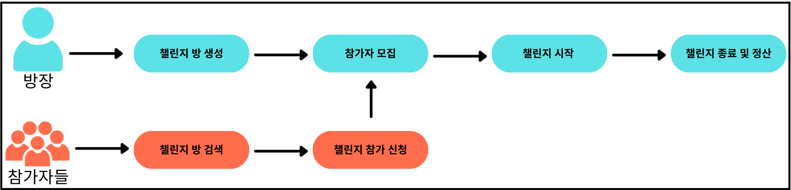
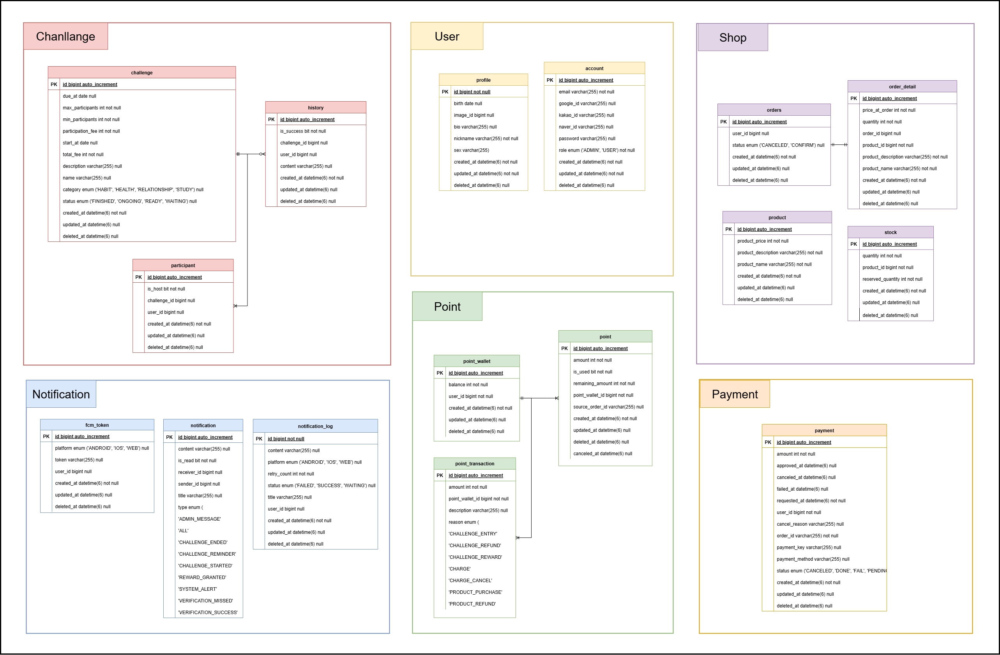
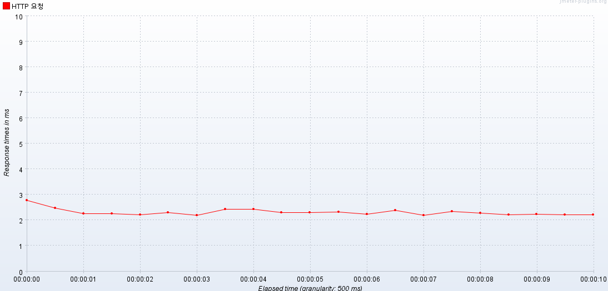
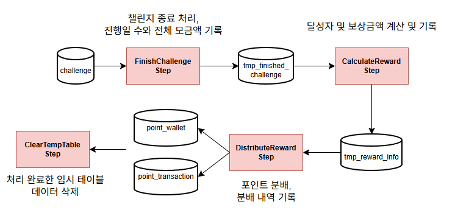

<div align="center">

# 💸내네 챌린지 플랫폼

<br>


<h3>“참가비를 걸고 함께 도전한다!”</h3>
단순 기록이 아닌, 강력한 <b>동기부여 플랫폼</b>

<br>

</div>

<br>
<br>
<br>


<h2>📋 목차</h2>

- [💰 내돈 네돈 챌린지가 뭐예요?](#-내돈-네돈-챌린지가-뭐예요)
- [✨ 내네 챌린지가 특별한 이유](#-내네-챌린지가-특별한-이유)
- [🎯 내네챌에는 이런 기능이 있어요](#-내네챌에는-이런-기능이-있어요)
- [🛠️ 우리가 사용한 기술들](#-우리가-사용한-기술들)
- [📐 프로젝트 설계](#-프로젝트-설계)
- [🤔 우리가 고민한 기술 선택들](#-우리가-고민한-기술-선택들)
- [🔧 차별화된 기능](#-차별화된-기능)
- [📈 우리가 진행한 성능 개선 방법](#-우리가-진행한-성능-개선-방법)
- [🚨 우리가 해결한 문제와 접근 방식](#-우리가-해결한-문제와-접근-방식)
- [🧑‍🤝‍🧑 팀원 소개](#-팀원-소개)

<br>
<br>
<br>


## 💰 내돈 네돈 챌린지가 뭐예요?

<div align="center">

<br>

<br>
<br>

**"내일부터 다이어트 해야지..."**  
**"이번엔 정말 운동 꾸준히 할거야!"**

작심삼일, 누구나 겪는 이야기죠.  
우리는 이 <b>__작심삼일의 벽__</b>을 깨트리는 **강력한 동기부여 플랫폼**을 만들었습니다.

<h3>💰 참가비를 걸고 함께 도전하세요!</h3>

</div>

<br>
<br>
<br>


## ✨ 내네 챌린지가 특별한 이유

#### 1. 손실 회피 본능을 통한 강력한 동기 부여
`챌린지 성공 시에는 투자한 포인트를 돌려받고 추가 보상까지 얻지만, 실패 시에는 참가비가 다른 사람에게 귀속됩니다.` <br>
`이러한 '손실 회피' 심리는 사용자가 챌린지를 중도에 포기하지 않고 끝까지 노력하게 만드는 강력한 원동력이 됩니다.`

#### 2. 보상에 대한 기대로 이끄는 더 큰 성취
`포인트와 추가 보상이라는 명확한 보상 구조는 사용자의 '보상 기대' 심리를 자극합니다.` <br>
`이는 챌린지를 성공적으로 마치고 더 큰 성취감을 맛보도록 유도하여, 목표 달성을 긍정적인 경험으로 각인시킵니다.`

#### 3. 함께하는 커뮤니티의 지속성 시너지
`혼자서는 흔들리기 쉬운 목표 달성 여정을, 같은 목표를 가진 사람들과 함께 완주합니다.` <br>
`'커뮤니티'의 존재는 서로에게 긍정적인 자극이 되어 지속성을 높이고, 챌린지 과정 자체를 즐거운 경험으로 만들어 줍니다.`


<br>
<br>
<br>

## 🎯 내네챌에는 이런 기능이 있어요

### 🚀 서비스 플로우


### 👤 사용자 이용 흐름 (프로젝트 핵심 흐름)


### 🔄 참여 프로세스

- 🔐 **소셜 로그인 시스템**<br>

    - 카카오/네이버 간편 로그인 : 복잡한 회원가입 과정 스킵


- 💳 **토스페이먼츠 포인트 충전**<br>

    - 실제 돈 → 포인트 안전 변환 : 필요한 만큼만 충전하는 스마트한 시작


- 💸 **All Or Nothing** 참가비 시스템 <br>

  - 성공하면 참가비 환급 + 실패자의 참가비 분배, 
  - 실패하면 전액 손실 : 절대 포기할 수 없는 강력한 동기부여


- 🛍️ **리워드 상점 시스템** <br>

    - 챌린지 상금으로 실물 상품 구매 : 노력이 실제 보상으로

<br>
<br>
<br>

## 📐 프로젝트 설계

### 📚 API 명세서
[API Documentation(swagger)](http://3.36.220.104:8080/swagger-ui/index.html)

### 🏗️ 시스템 아키텍처


### 🗂️ ERD



<br>
<br>
<br>


## 🛠️ 우리가 사용한 기술들


## 🤔 우리가 고민한 기술 선택들

| 기술                                      | 우리 프로젝트에서 왜 사용했는지                                             | 질문                                                                                                                                                                                                                                                   |
|-----------------------------------------|---------------------------------------------------------------|------------------------------------------------------------------------------------------------------------------------------------------------------------------------------------------------------------------------------------------------------|
| **🔔 FCM (푸시 알림)**                      | 챌린지 인증·보상·리마인드 알림을 **실시간 전송**하기 위해 사용                         | [왜 SSE나 WebSocket이 아닌 FCM을 선택했을까?](https://www.notion.so/teamsparta/SSE-WebSocket-FCM-2542dc3ef51480a4b5acf3a637be0c87)                                                                                                                              |
| **🔐 OAuth 2.0**                        | SNS 계정(카카오·네이버·구글)으로 **가입 장벽을 낮추고 빠른 유입**을 위해 사용              | [왜 단순 이메일 인증만 두지 않았을까?](https://www.notion.so/teamsparta/OAuth-2-0-2542dc3ef514807e85d2d7ef64bb1638?source=copy_link)                                                                                                                                |
| **💳 TossPayments API**                 | 애플리케이션 내부에서 자체 재화로 사용되는 **포인트를 결제**하기 위해 사용                   | [왜 많은 PG사 중에서 토스페이먼츠일까?](https://www.notion.so/teamsparta/TossPayments-API-2582dc3ef51480938e07c017cf02cd66)                                                                                                                                         |
| **🔴 Redis(캐싱)**                        | **검색 캐싱**으로 조회 성능 향상                                          | [왜 로컬 캐시 말고 Redis를 사용했을까?](https://www.notion.so/teamsparta/Redis-2542dc3ef5148084893ad5cc9911933e)                                                                                                                                                  |
| **🔴 Redis(재전송 큐**                      | **알림 재시도 큐**로 장애 대응                                           | [왜 Kafka나 RabbitMQ 대신 Redis를 썼을까?](https://www.notion.so/teamsparta/Kafka-Redis-RebbitMQ-Redis-2592dc3ef514801393bbdb1f83b9100d)                                                                                                                     |
| **🔎 Elasticsearch**                    | **닉네임/자기소개/상품 검색**에서 대규모 데이터 빠른 응답 보장                         | [왜 DB LIKE 쿼리 대신 Elasticsearch를 택했을까?](https://www.notion.so/teamsparta/Elasticsearch-2542dc3ef514809c9e8cca2019e13edb)                                                                                                                              |
| **⏱️ Spring Batch**                     | 챌린지 종료 및 달성자 보상 분배 **자동화**, **대량 데이터** 일괄 처리의 **정합성 및 안정성** 보장 | [왜 챌린지 종료와 정산을 배치로 처리했을까?](https://www.notion.so/teamsparta/Spring-Batch-2542dc3ef5148052a44ff177fdb9b89a)                                                                                                                                           |
| **🅰️ Amazon EventBridge + AWS Lambda** | 배치 서버 인스턴스를 **배치가 돌아가는 동안**에만 실행                              | [EC2를 필요할 때만 켜는 다른 방법은 없을까?](https://www.notion.so/teamsparta/Amazon-EventBridge-AWS-Lambda-2582dc3ef514809d9b40f06426c547ae)                                                                                                                        |
| **🐈‍⬛ CI/CD (GitHub Actions)**         | **주 2~3회 배포**를 자동화해 안정성과 속도를 확보                               | [Jar 파일은 꼭 수동으로 서버에 배포해야하나요?](https://www.notion.so/teamsparta/CI-CD-2542dc3ef51480b391a9f6cb583c0f4e)                                                                                                                                               |
| **📊 Promtail + Loki + Grafana**        | **트레이드 오프**를 고려하여 도커 컨테이너 내부의 로그·지표를 시각화해 장애 추적 용이            | [왜 ELK(Elastic Stack) 대신 Loki를 선택했을까?](https://teamsparta.notion.site/Loki-Grafana-2572dc3ef51480f0af97c334566cc213?source=copy_link)<br>[Promtail이 뭔데??](https://teamsparta.notion.site/Promtail-2562dc3ef5148092877cee8c2f95c375?source=copy_link) |
<br>
<br>
<br>


## 🔧 차별화된 기능

|    도메인     | 핵심 기능                         | 기술 구현                                                                                                        |
|:----------:|:------------------------------|:-------------------------------------------------------------------------------------------------------------|
| **👤 유저**  | 인증·인가 강화<br>고성능 검색·캐싱         | Spring Security 기반 인증/인가<br>JWT (Access/Refresh) + 블랙리스트·화이트리스트 관리<br>Elasticsearch + 캐시 레이어를 활용한 유저 검색 최적화  |
| **🎯 챌린지** | 챌린지 참가 동시성 제어<br>챌린지 종료 일괄 처리 | Redisson 분산 락을 통한 동시성 제어<br>Spring Batch를 이용한 챌린지 종료 및 달성자 포인트 분배 자동화                                        |
| **💳 결제**  | 토스페이먼츠 연동<br>서킷브레이커<br>비동기 처리 | 토스페이먼츠 API 포인트 결제<br>Resilience4j로 장애 격리<br>Spring Event로 결제/충전 분리                                           |
| **💰 포인트** | FIFO 차감<br>재시도 메커니즘           | 선입선출 포인트 사용<br>@Retryable 3회 자동 재시도                                                                          |
| **🛍️ 상점** | CQRS 구조<br>재고 무결성<br>캐시 전략    | 쓰기(DB) / 읽기(ES) 분리<br>재고 데이터 정합성을 위한 TCC 패턴 적용<br>첫 페이지 타겟 재빌드                                               |
| **🔔 알림**  | 재시도 큐<br>토큰 관리<br>이력 추적       | Redis ZSet + 스케줄러<br>웹/iOS/안드로이드 분리<br>성공/실패/대기 상태 관리                                                        |
| **📊 로깅**  | 행위 추적<br>안전 저장<br>수집·관측       | 컨트롤러/서비스 전 구간(알림·외부 API 제외) 로깅<br>JSON 구조화 + 개인정보 마스킹, 파일 보존·용량 관리<br>Promtail → Loki(S3 백엔드) → Grafana 대시보드 |


<br>
<br>
<br>


## 📈 우리가 진행한 성능 개선 방법
<details>
  <summary>💡 유저 검색, 어떻게 더 빠르게 만들었나요?* </summary>

- [[유저] 쿼리 성능 개선](https://www.notion.so/teamsparta/2542dc3ef51480bcbfc5c20d60521741?source=copy_link)
- [[유저] Elasticsearch 도입을 통한 검색 성능 개선](https://www.notion.so/teamsparta/Elasticsearch-2542dc3ef51480ffa6afc2a31a88ca9f?source=copy_link)


### 1. 문제 상황
- 사용자 검색 기능 고도화
- **MySQL 기반 최적화**: prefix 검색 적용, 조건 분기 처리, 인덱스 튜닝
- **Elasticsearch 도입**: ngram 분석기를 활용한 실시간 부분 일치 검색
- 검색 대상: 이메일, 닉네임, 자기소개 등 다중 필드

<br>
<br>

### 2. 문제 정의
- MySQL `LIKE '%keyword%'` 검색 시 인덱스를 활용하지 못해 **Full Scan 발생**
- 10만 건 이상 데이터에서 응답 지연 (수백 ms 수준)
- 100만 건 이상 데이터에서는 평균 **5초 이상 소요**
- FULLTEXT + ngram 파서도 성능 개선 효과 미미 (5.6초)
- 다국어/한글/혼합 문자열 검색에 부적합

<br>
<br>

### 3. 해결 방안
#### (1) MySQL 최적화
- `LIKE 'keyword%'` → 인덱스 활용 가능
- 불필요한 `IS NULL OR` 조건 제거 → 애플리케이션 단 분기 처리
- 복합 인덱스 (`id + nickname`) 검토
- 닉네임 컬럼 길이 최적화 (`VARCHAR(255)` → `VARCHAR(20)`)

#### (2) Elasticsearch 도입
- ngram 분석기 (`min_gram=2`, `max_gram=10`) 적용 → 부분 일치 최적화
- 다국어/한글 지원 (공백 없는 문자열 처리 가능)
- 다중 필드 검색 지원 (email, nickname, bio 등)
- Query DSL 기반 Bool Query 적용

<br>
<br>

### 4. 성능 테스트

##### MySQL 최적화
| 단계 | 평균 실행 시간 | 절대 개선(ms) | 개선율 | 개선 배수 |
| --- | --- | --- | --- | --- |
| 개선 전 | 404 ms | - | - | - |
| prefix 검색 적용 | 299 ms | -105 ms | 26% 감소 | 1.35배 |
| 조건 분기 처리 | 264 ms | -35 ms | 11.7% 감소 | 1.14배 |
| 복합 인덱스 | 264 ms | 0 ms | 차이 없음 | 차이 없음 |
| **최종** | **264 ms** | **-140 ms** | **34.7% 감소** | **1.53배** |

#### Elasticsearch 도입
| 항목 | 평균 응답 속도 (ms) | 절대 개선 (ms) | 실행 시간 감소율(%) | 기준 배수 |
| --- | --- | --- | --- | --- |
| MySQL LIKE 검색 | 5,183 | - | - | - |
| MySQL FULLTEXT (ngram parser) | 5,650 | -467 | -9.0% | 0.92 |
| **Elasticsearch (ngram)** | **94** | **-5,089** | **98.2%** | **55배 개선** |

결과: Elasticsearch 적용 후 검색 속도가 평균 **~55배 향상**, 실시간 검색 서비스 수준 확보.

<br>
<br>

### 5. 해결 완료
- MySQL 최적화로 **중소 규모 데이터셋(10만 건 수준)** 대응
- Elasticsearch 도입으로 **대규모 데이터셋(100만 건 이상)** 에서도 실시간 검색 응답 제공
- 다양한 검색 패턴(부분 검색, 다중 필드, 다국어)에 대응 가능

<br>
<br>

### 6. 향후 개선 사항
- **검색 품질 향상**: ngram + Nori 형태소 분석기 조합 → 한국어 의미 기반 검색 지원
- **UX 개선**: 자동완성, 오타 보정, 인기 검색어 기능 추가
- **운영 안정화**: DB ↔ ES 데이터 동기화 전략 고도화, 모니터링 체계 강화
- **성능 최적화**: 캐시(TTL 기반), 인덱스 최적화, Elasticsearch 클러스터링 통한 확장성 확보

</details>

<details>
  <summary>💡 알림이 실패하면 어떻게 하죠? </summary>

[장군호의 Velog 일기장](https://velog.io/@wkdrnsgh1/%EC%95%8C%EB%A6%BC%EC%9D%84-%EC%8B%A4%ED%8C%A8%ED%96%88%EB%8B%A4%EB%A9%B4-%EC%84%B1%EB%8A%A5%EA%B0%9C%EC%84%A0-%EC%9E%A5%EC%95%A0%EB%8C%80%EC%9D%91)

## 📌 개요
알림 서비스는 유저 경험에 직결된다.  
네트워크 장애, 토큰 만료, 서버 다운 등으로 전송이 실패하면 유저는 즉시 불편을 겪는다.  
따라서 알림은 "한 번 보내고 끝"이 아니라, **실패 시에도 유실 없이 추적하고 자동 재시도**하는 구조가 필요했다.

---

## 🚨 문제 상황
- 실패한 알림이 DB/서버 장애로 인해 **재시도 없이 유실됐을 가능성이 있다.**
- 다중 서버 환경에서는 큐 충돌이 **발생할 수 있다.**
- 상태 추적과 실시간 모니터링이 **어려웠을 것이다.**
- 결과적으로, 알림 누락 시 유저가 불편을 **직접 감당해야 했을 것이다.**

### 문제 흐름도


---

## 🏷️ 고려한 방법
1. **DB 기반 재전송 큐**
    - 장점: 구현이 단순하다.
    - 단점: **IO 병목 발생 → 대량 재전송 시 성능 급하락**

<br>

2. **Redis ZSet 기반 재전송 큐 (단일)**
    - 장점: 메모리 기반이라 DB보다 빠르다.
    - 단점: **단일 스레드 구조 → 대규모 트래픽 지연 발생**

<br>

3. **Redis ZSet 기반 재전송 큐 (병렬)**
    - 장점: **멀티 스레드 병렬 처리 → TPS 약 5배 향상**
    - 단점: 여전히 **단일 노드 한계** 존재

---

## 📊 성능 결과
| 항목 | DB 기반 | Redis ZSet (단일) | Redis ZSet (병렬) |
|------|---------|-------------------|-------------------|
| 1건 처리 시간 | 2.84 ms | 1.05 ms | **0.98 ms** |
| 500건 재시도 | 483 ms | 177 ms | **98 ms** |
| TPS | 339/s | 953/s | **5100/s** |

---

## 📊 시각 자료


---

## ✅ 결론
- **DB 기반**: 단순하지만 대량 처리에 한계가 있었다.
- **Redis ZSet (단일)**: 성능은 개선됐지만 단일 스레드 구조의 벽이 있었다.
- **Redis ZSet (병렬)**: TPS가 대폭 향상됐고, 30만 건 이상 테스트에서도 안정성이 확인됐다.
- 그러나 단일 노드 한계는 여전히 존재했다.

---

## 🔮 추후 개선사항
Redis 병렬 처리에도 여전히 **단일 노드 한계**가 있었다.  
이 문제는 Kafka의 **Partition 기반 분산 처리**로 해결할 수 있을 것 같다.

추가적으로 DLQ(Dead Letter Queue)를 도입해  
실패 메시지를 안정적으로 관리하는 방법도 시도해볼 수 있을 것이다.

---

</details>

<details>
  <summary>💡 인기 챌린지에 사람들이 몰리면 동시성 문제가 있을 것 같은데요?</summary>

[장군호의 Velog 일기장](https://velog.io/@wkdrnsgh1/%ED%94%84%EB%A1%9C%EC%A0%9D%ED%8A%B8%EC%97%90-%EB%A7%9E%EB%8A%94-%EB%9D%BD%EC%9D%80-%EB%AC%B4%EC%97%87%EC%9D%B8%EA%B0%80)

## 📌 개요
챌린지 참가 API는 동시에 수많은 요청이 몰릴 수 있다.  
하지만 단일 서버 환경에서 이를 제어하지 않으면 **포인트 중복 차감, 인원 제한 무시, 데이터 정합성 깨짐** 문제가 발생한다.

우리는 이 문제를 해결하기 위해 **DB 비관적 락**과 **Redisson 분산 락**을 비교 실험했고,  
그 결과를 바탕으로 성능 개선을 진행했다.

---

## 🚨 문제 상황
- **포인트가 중복 차감**되는 문제
- **인원 제한**이 무시되고 초과 참가자가 발생하는 문제
- 동시에 요청이 들어올 경우 **데이터 무결성이 깨지는 문제**

### 문제 흐름


---

## 🔧 개선 시도
1. **비관적 락 (DB 기반)**
    - 장점: 구현이 단순하고 소규모 트래픽에서는 빠르다.
    - 단점: 요청이 늘어나면 **락 경합으로 성능 급락** + 데드락 위험

2. **Redisson 분산 락 (Redis 기반)**
    - 장점: **분산 환경(MSA/멀티 인스턴스)**에서도 동작 가능
    - 장점: 요청이 많아도 **평균 응답 속도와 처리량이 안정적**
    - 단점: 일부 구간에서 최대 응답 시간이 튀는 현상

---

## 🧪 실험 결과

### 비관적 락


- 소량 트래픽(250건)에서는 빠르고 안정적
- 대량 트래픽(5000건)에서는 응답 지연이 폭발 → **최대 88초 이상 지연 발생**

---

### Redisson 락


- 요청이 수십 배 늘어나도 평균 응답 시간 안정적
- 처리량은 오히려 증가하는 패턴을 보임
- 일부 순간 최대 응답 시간이 튀었지만, 일시적 현상으로 추정

---

### 📊 비교 결과 요약
| 항목              | 비관적 락 (250건) | Redisson 락 (250건) | 비관적 락 (5000건) | Redisson 락 (5000건) |
|-------------------|------------------|---------------------|--------------------|----------------------|
| 평균 응답 시간     | **27ms**         | 64ms                | **202ms**          | **61ms**             |
| 최대 응답 시간     | 79ms             | 148ms               | **88,304ms**       | **490ms**            |
| 처리량 (req/s)    | **174.2**        | 76.6                | 35.3               | **80.8**             |

---

## 🚀 개선 효과
- **소량 트래픽**: 비관적 락이 더 빠르다.
- **대량 트래픽**: Redisson 락이 훨씬 안정적이다.
- 우리 프로젝트는 **MSA 확장**을 고려하고 있기 때문에  
  → **Redisson 분산 락**을 채택하여 성능을 개선했다.

---

## ✅ 결론
비관적 락은 소규모 환경에선 적합하지만,  
**대규모 트래픽 및 분산 환경에서는 Redisson 분산 락이 훨씬 안정적**이다.

이번 개선으로 **챌린지 참가 API의 안정성**을 확보했으며,  
앞으로 더 큰 트래픽에도 대응할 수 있는 기반을 마련했다.


</details>

<details>
  <summary>💡 결제 시스템, 돈은 빠졌는데 결제 실패? 우리가 이 악몽을 끝낸 방법</summary>

## 🎯 기능 소개

https://ddokyun.tistory.com/66

### 결제 시스템 개요

우리 서비스는 토스페이먼츠를 통한 결제와 포인트 충전 기능을 제공합니다. 사용자가 결제를 완료하면 자동으로 포인트가 충전되는 구조로, 다음과 같은 플로우로 동작합니다

1. **사용자 결제 요청** → 토스페이먼츠 결제 위젯 표시
2. **결제 정보 입력** → 카드/계좌 정보 입력 및 결제 진행
3. **결제 승인 처리** → 토스페이먼츠 API를 통한 결제 승인
4. **포인트 충전** → 결제 금액만큼 사용자 포인트 충전
5. **완료 응답** → 사용자에게 결제 완료 알림

---

## ⚠️ 문제 정의

### 🐌 성능 문제: 긴 응답시간 (평균 738.3 ms)

기존 동기식 처리 방식에서는 모든 작업이 순차적으로 진행되어 긴 응답시간이 발생했습니다.

**처리 플로우 및 타임아웃 설정:**


- **최악의 경우**: 총 40초 소요 가능
- **실제 측정 결과** (30회 테스트):
    - **평균**: 738.3 ms
    - **최소**: 590 ms
    - **최대**: 1,008 ms
    - **표준편차**: 약 90 ms

### 🔥 장애 전파 문제

포인트 서비스 장애 시 전체 결제가 실패하는 구조적 문제가 있었습니다.

**문제 시나리오:**

1. 토스페이 결제 진행 → 사용자 카드에서 돈 차감 완료
2. 포인트 충전 시도 → 포인트 서버 오류로 실패
3. 전체 API 실패 응답 → 사용자는 "결제 실패"로 인식

**핵심 문제점:**

- 결제는 이미 완료된 상태인데 부가 기능(포인트) 때문에 전체 실패 처리
- 사용자 혼란: "돈은 빠졌는데 왜 실패?"
- 부분 장애가 전체 시스템을 마비시키는 구조
- 결과적으로 사용자 이탈률 증가 및 고객 불만 야기

### ⏱️ 재시도 로직 도입 시 대기시간 증가

### 동기 방식에서 포인트 충전 안정성을 위해 재시도 로직을 도입할 경우:


- **재시도 없음** → 포인트 유실 위험
- **재시도 있음** → 사용자 경험 악화 (최악의 경우 50초 이상)

---

## 💡 해결 방안

### 🔄 Spring Event를 활용한 비동기 처리

**결제 승인(핵심 기능)**과 **포인트 충전(부가 기능)**을 분리하여, 사용자는 결제 완료를 즉시 확인하고 포인트 충전은 백그라운드에서 안정적으로 처리하도록 개선했습니다.

### 💻 구현 코드

### **Before (동기식 처리):**
```
public PaymentConfirmResult confirmAndChargePoint(Long userId, PaymentConfirmCommand command) {
    // 유저 검증
    userClient.getUserById(userId);
    
    try {
        // 토스 결제 승인
        TossConfirmResult tossConfirmResult = tossClient.confirmPayment(
            command.getPaymentKey(),
            command.getOrderId(),
            command.getAmount()
        );
        
        // 금액 검증
        paymentService.validatePaymentAmount(
            tossConfirmResult.getTotalAmount(), 
            command.getAmount()
        );
        
        // Payment 객체 생성
        Payment payment = paymentService.createPaymentFromConfirm(
            userId, 
            tossConfirmResult
        );
        
        // 포인트 충전 (동기식 - 여기서 대기!)
        pointClient.chargePoint(
            userId,
            command.getAmount(),
            "CHARGE",
            tossConfirmResult.getOrderId()
        );
        
        return PaymentApplicationMapper.toPaymentConfirmResult(payment);
    } catch (RestClientResponseException e) {
        // 에러 처리...
    }
}
```
<br>

### After (비동기식 처리):
```
/**
     * 결제 승인 및 포인트 충전 요청 처리
     * 1. 사용자 검증 -> 2. 토스 결제 승인 -> 3. Payment 객체를 DONE 으로 변경 -> 4. 포인트 충전, 알림 이벤트 발행
     */
    public PaymentConfirmResult confirmAndChargePoint(Long userId, PaymentConfirmCommand command) {
        boolean userVerified = false;
        boolean tossPaymentSucceeded = false;
        TossConfirmResult tossConfirmResult = null;

        try {
            // 1. 사용자 검증
            userClient.getUserById(userId);
            userVerified = true;

            // 2. 토스 결제 승인
            tossConfirmResult = tossClient.confirmPayment(
                command.getPaymentKey(), command.getOrderId(), command.getAmount());
            tossPaymentSucceeded = true;

            // 3. Payment 성공 처리
            Payment payment = paymentService.markAsSuccess(tossConfirmResult, command.getAmount());

            // 4. 포인트 충전 및 알림 전송 이벤트 발행
            publishPaymentCompletedEvent(payment);

            return PaymentApplicationMapper.toPaymentConfirmResult(payment);

        } catch (RestClientResponseException e) {
        // 에러 처리...
    }
}

private void publishPaymentCompletedEvent(Payment payment) {
        try {
            eventPublisher.publishEvent(
                new PaymentCompletedEvent(
                payment.getUserId(),
                payment.getAmount().getValue(),
                "CHARGE",
                payment.getOrderId().getValue()
                )
            );
        } catch (Exception e) {
            ...
        }
    }
```
<br>

### 비동기 이벤트 핸들러:
```
@Component
@RequiredArgsConstructor
@Slf4j
public class PointChargeEventHandler {
    
    private final PointClient pointClient;
    
    @EventListener
    @Async
    @Retryable(
        retryFor = {Exception.class},              // 모든 예외에 대해 재시도
        noRetryFor = {IllegalStateException.class}, // 파라미터 오류는 제외
        maxAttempts = 3,                           // 최대 3회 시도
        backoff = @Backoff(delay = 1000)           // 1초 간격
    )
    public void handlePointCharge(PointChargeRequested event) {
        log.info("포인트 충전 시도: orderId = {}", event.getOrderId());
        
        pointClient.chargePoint(
            event.getUserId(),
            event.getAmount(),
            event.getReason(),
            event.getOrderId()
        );
        
        log.info("포인트 충전 성공: orderId = {}", event.getOrderId());
    }
    
    @Recover
    public void recover(Exception e, PointChargeRequested event) {
        log.error("포인트 충전 최종 실패 - 수동 처리 필요: orderId = {}", 
                  event.getOrderId(), e);
        // 알림 발송 추가 처리
    }
}
```

---
## 📊 성능 테스트

### 🛠️ 테스트 환경

- **테스트 방법**: 실제 토스 결제를 통한 수동 테스트
- **테스트 횟수**: 각 30회
- **측정 지표**: API 응답시간 (Controller 내부 측정)

### 📈 테스트 결과

| 동기식 테스트 결과 | 비동기식 테스트 결과 |
|:---:|:---:|
|  |  |
| [상세 보기](https://ddokyun.tistory.com/62) | [상세 보기](https://ddokyun.tistory.com/64) |

### 📊 응답시간 분포 분석

| 응답시간 구간 | Before (동기식) | After (비동기식) |
|:---:|:---:|:---:|
| **600ms 이하** | - | **40.0%** |
| **600-700ms** | - | **53.3%** |
| **700ms 이하** | **26.6%** | - |
| **700-800ms** | **40.0%** | - |
| **700ms 이상** | - | **6.7%** |
| **800ms 이상** | **33.4%** | - |

## 📈 테스트별 응답시간 비교


| 구분 | Before (동기식) | After (비동기식) | 개선 효과 |
| --- | --- | --- | --- |
| 평균 응답시간 | 738.3 ms | 621.6 ms | 116.7 ms 단축 (15.8% 개선) |
| 최소 응답시간 | 590 ms | 541 ms | 49 ms 단축 |
| 최대 응답시간 | 1,008 ms | 786 ms | 222 ms 단축 (22% 개선) |
| 표준편차 | 약 90 ms | 약 70.7 ms | 안정성 21% 향상 |

---

## ✅ 해결 완료

### 🚀 성능 개선 달성

- **평균 응답시간 15.8% 단축**: 738.3 ms → 621.6 ms
- **최대 응답시간 22% 개선**: 1,008 ms → 786 ms
- **응답시간 안정성 21% 향상**: 표준편차 감소

### 🛡️ 장애 격리 달성

https://ddokyun.tistory.com/65

**장애 시나리오 테스트 결과:**

포인트 서비스에 6초 지연 발생 시 (타임아웃 5초):

- **동기식**:
    - 3회 재시도 후 결제 실패
    - 토스 결제 취소 처리
    - 사용자 대기시간: 약 18초
    - 결과: 결제 실패
- **비동기식**:
    - 결제 즉시 성공 응답
    - 백그라운드에서 재시도
    - 사용자 대기시간: 약 0.6초
    - 결과: 결제 성공, 포인트는 추후 충전

### 🏆 주요 개선 효과

1. **사용자 경험 개선**
    - **결제 응답 속도 향상**
    - **포인트 장애가 결제에 영향 없음**
    - 안정적인 결제 서비스 제공
2. **시스템 안정성 향상**
    - 장애 격리로 부분 장애 대응 가능
    - **재시도 로직으로 일시적 장애 자동 복구**

---

## 🔮 향후 개선 사항

- **실패 알림 시스템 구축**: 포인트 충전 최종 실패 시 관리자 알림
- **재처리 배치 작업**: 실패한 포인트 충전 건 일괄 재처리
</details>

<details>
  <summary>💡 상점 메인 페이지, 안정적으로 보여주자</summary>

  ## 🚨 문제 정의

  - 상품 목록 조회의 가장 첫 번째 페이지는 트래픽이 많이 몰리는 구간으로 밑에 조건과 같이 부하 테스트를 진행하였습니다.
  - ✅ 테스트 조건 : Thread 200 / Ramp - up 10초 / Roof Count 100)
    
 | 항목 | 값 | 해석 요약 |
 | --- | --- | --- |
 | 총 요청 수 | 20,000건 | 총 수행된 요청 수. 테스트 규모 기준 |
 | 평균 응답 시간 | 41ms | 매우 빠른 응답 속도 |
 | 최대 응답 시간 | 2532ms | 일부 요청이 2.5초 지연 → 병목 |
 | 표준편차 | 120.03ms | 응답 편차 큼 → 일관성 부족 우려 |
 | 에러율 | 0.000% | 모든 요청 정상 처리. 안정적 |
 | 처리량 (TPS) | 1430.41 req/s | 초 당 요청 처리 능력 우수 |
 | 수신량 | 6024.2 KB/s | 서버가 반환한 데이터 총량 |
 | 전송량 | 189.98 KB/s | 클라이언트 → 서버 전송량 |
 | 평균 응답 크기 | 4312.6 Byte | 응답당 약 4.3KB → 일반적인 JSON 응답 수준 |
- 최대 응답 시간이 2532ms으로, 특정 사용자는 2.5초 이상을 대기 해야 합니다. (병목 발생)

---

## 💡 해결 방안

### 데이터 캐싱 전략

- 선택 이유 : 

   - 실제 실무에서 첫 페이지에 대한 캐싱 전략을 선택한 사례가 많습니다.
   - __DB에 접근하는 것 자체가 많은 시간이 소요__ 되기 때문에, 트래픽이 많은 부분에서는 __DB 접근을 최소한__ 으로 하는 캐싱 방식이 선택하였습니다.

---

## ⚙️ 성능 테스트

### Cache 적용 전
- 부하 테스트 :
- ✅ 테스트 조건 : Thread 200 / Ramp - up 10초 / Roof Count 100)

Response Times Over Time


Hits per Second


Active Threads Over Time


TPS


<br>
<br>
<br>

### Cache 적용 후
- 부하 테스트 :
- ✅ 테스트 조건 : Thread 200 / Ramp - up 10초 / Roof Count 100)

Response Times Over Time


Hits per Second


Active Threads Over Time


TPS


---

## ⭐ 성능 개선 결과

| 항목 | 캐싱 적용 전 | 캐싱 적용 후 | 변화 |
| --- | --- | --- | --- |
| 평균 응답 시간 (ms) | 41 | 2 | ⬇️ **-95%** |
| 최소 응답 시간 (ms) | 2 | 1 | ⬇️ |
| 최대 응답 시간 (ms) | 2532 | 14 | ⬇️ **-99.4%** |
| 표준 편차 | 120.03 | 0.77 | ⬇️ |
| 오류율 | 0.000% | 0.000% | 동일 |
| 처리량 (TPS) | 1430.41 | 1949.89 | ⬆️ **+36%** |
| 수신 속도 (KB/s) | 6024.2 | 8210.09 | ⬆️ |
| 전송 속도 (KB/s) | 189.98 | 258.97 | ⬆️ |
| 평균 응답 바이트 크기 | 4312.6 | 4311.6 | 거의 동일 |

<br>
<br>
<br>

### 캐시 안정성 테스트
- 캐싱 처리된 첫 페이지에 10초 동안 40000만 건, 60000만 건의 부하 테스트를 진행하였습니다.

| 항목 | 캐시 적용 (40000건) | 캐시 적용 (60000건) | 분석 |
| --- | --- | --- | --- |
| **총 요청 수** | 40,000 | 60,000 | 요청 수가 50% 증가 |
| **평균 응답 시간 (ms)** | 12ms | 40ms | ⬆️요청 수 증가로 평균 응답 시간 3.3배 증가  |
| **최소 응답 시간 (ms)** | 1ms | 1ms | 동일 |
| **최대 응답 시간 (ms)** | 55ms | 103ms | ⬆️ 최대 응답 시간도 2배 증가 |
| **표준 편차** | 6.43ms | 17.6ms | ⬆️ 분산이 더 커짐  |
| **오류율** | 0.000% | 0.000% | ⬆️ 안정적 처리 유지 |
| **처리량 (req/sec)** | 3,271.45 | 3,389.83 | 처리량은 비슷하거나 소폭 증가함 |
| **수신량 (KB/sec)** | 13,774.57 | 14,273.05 | ⬆️ 증가한 요청 수에 비례 |
| **전송량 (KB/sec)** | 434.49 | 450.21 | ⬆️ 약간 증가 |
| **평균 바이트 크기** | 4,311.6 | 4,311.6 | 동일 |

- **성능 유지**
    - 요청 수가 40,000건에서 60,000건으로 50% 증가했음에도 오류 없이 안정적인 처리량을 유지하였습니다. 이는 **캐시를 통해 성능 저하 없이 부하를 흡수할 수 있었음을 보여줍니다.**
- **응답 시간 증가**
    - 평균 응답 시간이 12ms에서 40ms로 약 3.3배 증가하였습니다. 이는 요청 수 증가에 따른 부하 영향으로 **상대적으로 성능 저하가 존재하는 것은 사실**입니다. 다만, 평균 40ms 수준의 응답 시간은 대부분의 서비스에서 **사용자 경험에 큰 영향을 주지 않는 수준**입니다.
- **표준편차 확대**
    - 표준편차가 6.43ms에서 17.6ms로 증가하여 **일부 요청에서 지연이 발생했음을 의미**하지만, 전체적인 응답 시간이 수십 ms 내외이므로 **사용자 경험에 중대한 영향을 줄 가능성은 낮습니다.**

---

## 향후 개선 사항
- 인기 상품 선정 및 인기 상품 TOP 100에 대한 캐시 적용
- 캐시 정책을 통한 캐시 효율 극대

</details>

<details>
 <summary>💡 상점 상품 검색, 왜 느릴까요?</summary>

 ## 문제 정의
 
 
 - MySQL 데이터 100만 건에서, 상품 다 건 검색 조회 결과 : `595ms`
 - 이는 다소 느려 사용자 경험(UX)에 부정적인 영향을 미치므로, 쿼리에 대한 문제를 분석해보았습니다.

---

 ## 문제 분석
 1. 현재 데이터 셋
```text
    id    |     product_name
----------------------------------
     1    |    1 GS 기프티콘
    ...   |    ...
   100001 |    100001 CU 기프티콘
    ...   |    ...
   200001 |    200001 kakao 기프티콘
    ...   |    ...
```

 2. 문제되는 쿼리
 ```sql
SELECT *
FROM product
WHERE product_name LIKE '%Kakao%'
and deleted_at is null
and id <= 900000
ORDER BY id DESC
LIMIT 30;
```

 3. EXPLAIN ANLAYZE 검사

```Text
EXPLAIN ANALYZE
-----------------------------------------------------------------------------------------------------------------------------
-> Limit: 30 row(s)  (cost=99433 rows=30) (actual time=529..529 rows=30 loops=1)
    -> Filter: ((product.product_name like '%Kakao%') and (product.deleted_at is null) and (product.id <= 900000))  (cost=99433 rows=5508) (actual time=529..529 rows=30 loops=1)
        -> Index range scan on product using PRIMARY over (id <= 900000) (reverse)  (cost=99433 rows=495779) (actual time=0.0563..354 rows=610030 loops=1)
```

- `id <= 900000, reverse`  : id 900000부터 reverse 탐색 시작
- `%Like%` : id 900000부터, CPU에서 문자열 비교 연산 매 row마다 진행 (이때부터 Full scan, **병목 지점**)
- `deleted_at is null` : row 읽을 때마다 함께 조건 검사 진행
- `LIMIT 30`  인해, %Like%가 최대 30개까지만 만족하도록 지정


---

 ## 해결 방안
 ### MySQL FULLTEXT N-gram parser 방식
 - 단점

   
   
   - MySQL token 수가 증가합니다.
     - 실제 데이터 row 수 100만 개
     - token 약 1,000만 개
     - `10배 차이 (단점)`

 ```Text
EXPLAIN ANALYE
----------------------------------------------------------------------------------------------------------------------------------------------------
-> Limit: 30 row(s)  (cost=0.57 rows=1) (actual time=459..460 rows=30 loops=1)
-> Sort row IDs: product.id DESC, limit input to 30 row(s) per chunk  (cost=0.57 rows=1) (actual time=459..460 rows=30 loops=1)
-> Filter: ((match product.product_name against ('GS25' in boolean mode)) and (product.deleted_at is null) and (product.id <= 999999))  (cost=0.57 rows=1) (actual time=33.6..430 rows=90000 loops=1)
-> Full-text index search on product using ft_product_name (product_name='GS')  (cost=0.57 rows=1) (actual time=33.6..414 rows=100000 loops=1)
  ```
- 특정 단어에 대한 상품이 많을 수록 매칭 결과가 많아(100000), N-gram의 성능이 저하가 되었습니다.
- `성능 개선 대비, 너무 많은 Token 수 증가로 고려 대상에서 제외`하였습니다.

### LIKE% + 복합 INDEX 방식
```Text
    id    |     product_name
----------------------------------
     1    |    GS 기프티콘 1
    ...   |    ...
   100001 |    CU 기프티콘 100001 
    ...   |    ...
   200001 |    kakao 기프티콘 200001 
    ...   |    ...
```
- LIKE% 검색 조건에 맞춰 검색할 키워드를 맨 앞으로 보내도록, 데이터 셋을 변경하였습니다.
```sql
SELECT *
FROM product
WHERE product_name LIKE 'Kakao%'
and deleted_at is null
and id <= 900000
ORDER BY id DESC
LIMIT 30;
```

<br>

```sql
CREATE INDEX idx_deleted_product ON product(deleted_at DESC, id DESC, product_name);
```

- B-Tree 인덱스에서 복합 컬럼의 저장 방식과 MySQL 인덱스 탐색 규칙에 따라 복합 인덱스 순서를 정하였습니다.
- 상세 내용
    - `deleted_at =NULL AND id ≤ 900000` : 인덱스 탐색 범위
    - 그 중 `Kakao%` 만 필터링 합니다.
        - Index Condition Pushdown(ICP) 통해, 인덱스 레코드에서 비교하므로, 불필요한 테이블 엑세스를 줄입니다.

    <br>
    ⭐ id와 product_name의 위치를 바꾸면 MySQl 인덱스 탐색 규칙에 따라 더 성능이 개선됩니다. 하지만, 그렇게 되면 최신 순으로 정렬되지 않기 때문에, 고려하지 않았습니다.

<br>

```Text
EXPLAIN
---------------------------------------------------------------------------------------------------------------------------------------------------------------------------------------------------------------------------------------------------------------------
-> Limit: 30 row(s)  (cost=1.02e+6 rows=30) (actual time=90.7..90.7 rows=30 loops=1)
    -> Index range scan on product using product_index over (deleted_at = NULL AND 900000 <= id AND 'Kakao' <= product_name), with index condition: ((product.product_name like 'Kakao%') and (product.deleted_at is null) and (product.id <= 900000))  (cost=1.02e+6 rows=482271) (actual time=90.7..90.7 rows=30 loops=1)
```
- `MySQL Prefix + 복합 인덱스` 방식, 상품 다 건 검색 조회 결과 : `0.087s`
- Table Full Scan이 발생하지 않습니다.

---

 ## 성능 비교 결과

1. postman 10번 시도


<br>
<br>

2. Explain Analyze 10번 시도

| 항목 | actual time | 평균 actual time | 개선 배수(vs Inflix) |
| --- | --- | --- | --- |
| %LIKE% | 543~614ms | 약 571.4ms |  |
| N-gram parser | 423~507ms | 약 450.3ms | **약 1.27배** |
| LIKE% + 복합 인덱스 | 87~145ms | 약 116.0ms | **약 4.92배** |

가장 성능 개선이 많이 된, `Like% + 복합 인덱스 방식`으로 개선하였습니다.

---

 ## 향후 개선 사항
- 현재는 성능 개선을 위해 Infix 검색 대신 LIKE% 검색을 선택하였으나, Elasticsearch 도입하여 %LIKE% 검색 환경에서도 높은 성능을 확보하는 것을 목표로 하고 있습니다.

<br>
<br>
<br>

</details>

<details>
 <summary>💡 상점 상품 검색, 어떻게 더 빠르게 만들었나요?</summary>

## 문제 정의


---

## 해결 방안
Elasticsearch N-gram은 %LIKE%와 유사한 부분 문자열 검색을 지원하면서도, 역색인 구조를 활용해 훨씬 빠르고 안정적인 성능을 제공합니다.

---

## 성능 테스트

### MySQL %LIKE% 테스트
- 부하 : Thread(200), Ram-up(10), 반복(10)
- 환경 : docker
- 조건 : 검색어 o, 최신으로 30개 조회
- 결과 :

Hit per seconds


Response Times Over Time


Active Threads Over Time


Transactions per Second


<br>
<br>
<br>

### Elasticsearch N-gram 테스트
- **부하 :** Thread(200), Ram-up(10), 반복(10)
- **환경 :** docker
- **인덱스 크기 :**


- **조건 :** min-gram : 2, max-gram : 5, 검색어 x, 삭제 된 상품 조회 x, 최신으로 30개 조회
- **결과 :**

Hit per seconds


Response Times Over Time


Active Threads Over Time


Transactions per Second


### POSTMAN 10회 테스트


- MySQL %LIKE% 조건이 서비스의 품질이 제일 좋지 않습니다.

---

## 성능 테스트 결과

| 지표 | MySQL(%LIKE%) | Elasticsearch(N-gram) | 절대적 차이 | 개선율 % |
| --- | --- | --- | --- | --- |
| 표본 수 | 2000 | 2000 | 0.0 | 0.0 |
| 평균(ms) | 20585 | 7 | -20578.0 | 99.97% ↓ |
| 최소값(ms) | 680 | 4 | -676.0 | 99.41% ↓ |
| 최대값(ms) | 30063 | 64 | -29999.0 | 99.79% ↓ |
| 표준편차 | 5280.48 | 3.54 | -5276.94 | 99.93% ↓ |
| 오류 % | 1.35 | 0.0 | -1.35 | 완전 제거 |
| 처리량(req/s) | 8.818 | 199.760 | 190.942 | 2065.7% ↑ |
| 수신 KB/초 | 35.43 | 812.28 | 776.85 | 2192.2% ↑ |
| 전송 KB/초 | 1.28 | 29.07 | 27.79 | 2171.8% ↑ |

- **평균 응답 시간**이 `20,583ms → 7ms 감소`하여, 거의 실시간 수준으로 개선되었습니다.
- **최대 응답 시간**도 `30초 → 64ms 단축`되어 최악의 경우에도 안정적인 응답을 보장합니다.
- **오류율** `1.35% → 0% 개선`하여, 부하가 걸리더라도 안정적인 응답을 보장합니다.
- **표준편차** 또한 `5,280 →3.54` 응답 일관성이 확보되었습니다.
- **초당 처리량**이 8.8 req/s → 199.8 req/s 약 `23배 증가`하였습니다.

---

## 향후 개선 사항
- Elasticsearch n-gram 한계
    - 긴 문자열 검색 누락 (max_gram 한계)
    - 인덱스 크기 폭발
- 해결 방안
  - edge_ngram + n-gram 멀티 필드 전략
  - 한국어 분석기/No-ri 플러그인 적용
  - 인기 키워드 캐싱 + 계층화된 검색 구조 운영

</details>

<details>
  <summary>💡 리소스를 최소화하여 장애 대응까지..</summary>
# 문제 정의

- 각 API 메서드마다 **AopLoggingData DB에 동기 저장** 후 각 저장데이터와 병합 후 시각화 → 요청 경로에서 **INSERT/트랜잭션/인덱스 갱신** 발생
<br>
- 트래픽 피크 구간에서 **DB 커넥션 풀 대기/락 경합/스토리지 증가**가 누적 → 일부 요청의 **레이트시(최대/상위 분위)** 스파이크
  <br>
- **관측성** 또한 **애플리케이션 로그만**으로는 부족(ES/Redis 등 **동일 타임라인 상관관계 분석 어려움**)

---

# 해결 방안

- **데이터 경로 변경(요청 경로 단순화)**

  **DB 로깅 제거 → 파일 append(Logback JSON)** 로 전환, **Promtail**이 비동기로 수집/전송 → **Loki** 적재 → **Grafana** 시각화
  <br>
- **수집 범위 확대**

  앱 로그뿐 아니라 **동일 컨테이너의 ES/Redis 등 인프라 에러 로그**까지 수집 → **헬스체크/장애 상관분석** 강화
  <br>
- **트레이드오프 고려**

  EC2 디스크 I/O/용량 vs. 로그 유실 가능성. 우리 서비스는 **금전/정산 + 유저 행위 추적**이 핵심 → **원본 보존 후 수집** 전략 채택

---

# 성능 테스트

( 첨부 예정 )

---

## 트레이드오프 및 대응

- **디스크 I/O/용량 관리**
    - Logback **size/time 로테이션**, `totalSizeCap`, `maxHistory` 설정
    - 디스크 I/O 사용시 비동기 처리로 트랜잭션 별도 관리
      <br>
- **라벨 카디널리티 제어**
    - 라벨은 `service`, `env`, `version`, `traceId` 중심으로 최소화
      <br>
- **로깅 과정 중 DB 리소스 사용 없음**
    - **요청 경로 DB 쓰기 제거**로 **지연/변동성 하락**, TPS 여유 증가
      <br>
</details>

<details>
  <summary>💡 배치 서버 새벽 안에 끝나죠?</summary>

# 🛠️ 배치 프로그램 기능

- 마지막 진행일을 넘어간 챌린지 상태를 `FINISHED`로 변경
- 달성자와 보상 금액 판별
- 달성자에게 보상 지급

# 🎯 문제 정의

- 배치 프로그램은 **새벽 시간 내 작업 완료 필요**
- AWS EC2 인스턴스를 사용 → **배치 프로그램 실행 시간만큼 비용**
- 따라서 **빠르게 끝날수록 좋음**

---

# 📝 성능 개선 과정

## 💾 임의 데이터 생성

- 100만 건의 처리할 챌린지
- 참가자 1-10명 정도
- 1-40일 정도 임의의 진행 기간
- 10%의 달성자 - 100% 인증률, 나머지 사용자 - 10% 인증률

## 🔎 슬로우 쿼리 파악과 인덱싱을 통한 성능 개선

- Step 별로 처리 시간 측정 → 병목 Step 파악
- 프로그램 내부 로깅 + MySQL slow query 로그 확인 → 슬로우 쿼리 식별

    ```sql
    UPDATE point_wallet SET balance = balance + 2251 WHERE user_id = 578531;
    # Time: 2025-08-12T06:01:07.156521Z
    # Query_time: 1.179324  Lock_time: 0.000002 Rows_sent: 0  Rows_examined: 1000000
    ```

    - `point_wallet`: 사용자의 포인트 관련 정보
    - `user_id`: 사용자 식별자
- `EXPLAIN`으로 실행 계획을 파악 → index scan이지만 PK 사용 = Full Table Scan

  | id | select_type | table | partitions | type | possible_keys | key | key_len | ref | rows | filtered | Extra |
  | --- | --- | --- | --- | --- | --- | --- | --- | --- | --- | --- | --- |
  | 1 | UPDATE | point_wallet |  | index |  | PRIMARY | 8 |  | 997,194 | 100.0 | Using where |

- **`user_id`** 칼럼 → **`WHERE`에 자주 사용**하고 **고유한 칼럼 → 단일 칼럼 고유 인덱스 설정**
- 쿼리 실행 시간 1.5s → 57ms

  

  

- 삽입 성능 79ms로 양호

  

## 🔧 chunk 크기 튜닝

### chunk 크기에 따른 장단점

| 큰 chunk 크기                              | 작은 chunk 크기                                   |
|-----------------------------------------|-----------------------------------------------|
| - 커밋 횟수 감소 → 성능 향상<br>- 네트워크 라운드 트립량 감소 | - 롤백 비용 감소<br>- DB 락 점유 시간 감소<br>- 메모리 소모량 감소 |

- 크기 늘려가며 실행 시간 관찰
- OOM 발생하지 않도록 메모리 사용량 관찰

### 성능 지표 및 측정 방법

- JVM Heap: OOM 방지 위한 메모리 사용량 → JConsole

  

- GC 시간: 병목 가능성의 부가 지표 → JConsole

  

- 디스크 사용량: MySQL IO 처리량 → 윈도우 Perfmon

  

- 실행 시간 → 배치 프로그램 로그

  

### Step 별 측정 결과 및 해석

- 전체 Step 흐름

  

1. **FinishChallengeStep**

    | 청크 크기/ Step | 500   | 1000  | 5000  | 10000 |
    |-------------|-------|-------|-------|-------|
    | JVM Heap    | 40mb  | 45mb  | 120mb | 80mb  |
    | GC 시간       | 1.4ms | 1.6ms | 2,6ms | 3.9ms |
    | 소요 시간       | 7m21s | 6m21s | 5m13s | 4m23s |
    | 디스크 사용량     | 95%   | 95%   | 95%   | 95%   |

    - **커밋 횟수 감소** → **시간 감소**

2. **CalculateRewardStep**

    | 청크 크기/ Step | 500    | 1000   | 5000        | 10000       |
    |-------------|--------|--------|-------------|-------------|
    | JVM Heap    | 40mb   | 50mb   | 50-150mb 진동 | 50-100mb 진동 |
    | GC 시간       | 1.4ms  | 1.11ms | 1.89ms      | 2.4ms       |
    | 소요 시간       | 19m29s | 18m5s  | 16m37s      | 14m39s      |
    | 디스크 사용량     | 70%    | 50%    | 10 → 순간적 90 | 10 → 순간적 90 |

    - chunk가 커질수록 **디스크 사용량이 간헐적**으로 **순간적 상승**
    - 어플리케이션 병목 → **멀티스레드** 전환 시 큰 **성능 향상 기대**

3. **DistributeRewardStep**

    | 청크 크기/ Step | 500   | 1000  | 5000  | 10000 |
    |-------------|-------|-------|-------|-------|
    | JVM Heap    | 70mb  | 100mb | 130mb | 140mb |
    | GC 시간       | 1.5ms | 1.5ms | 2.7ms | 15ms  |
    | 소요 시간       | 4m3s  | 3m27s | 2m10s | 2m35s |
    | 디스크 사용량     | 90%   | 90%   | 90%   | 90%   |

    - chunk를 너무 키웠을 시 시간 증가 → **SQL 쿼리 효율 감소**로 추정

### ✅ 결과 정리 및 선택

| 청크 크기/ Step | **FinishChallengeStep** | **CalculateRewardStep** | **DistributeRewardStep** | 총합     |
|-------------|-------------------------|-------------------------|--------------------------|--------|
| 500         | 7m21s                   | 19m29s                  | 4m3s                     | 30m53s |
| 1000        | 6m21s                   | 18m5s                   | 3m27s                    | 27m53s |
| 5000        | 5m13s                   | 16m37s                  | 2m10s                    | 24m0s  |
| 10000       | 4m23s                   | 14m39s                  | 2m35s                    | 21m37s |

- 대체로 chunk 크기와 실행시간은 반비례
- 메모리 충분
- 롤백 비용과 락 점유 시간 고려한 chunk 크기 설정
    - DistributeRewardStep: 읽기 위주 + 큰 chunk 부담 없음 → 10000
    - CalculateRewardStep: 읽기 위주이나 메모리 안정성 고려 → 1000
    - DistributeRewardStep: ****여러 테이블/인덱스에 락 + 값 수정  → 1000

## 🔀 멀티스레딩을 통한 개선

- chunk 크기는 바로 위 설정과 동일하게 설정
- 실행 환경의 논리코어 4개

| 스레드 수/ Step | **FinishChallengeStep** | **CalculateRewardStep** | **DistributeRewardStep** | 총합 |
| --- | --- | --- | --- | --- |
| 싱글 스레드 | 4m23s | 18m 5s | 3m27s | 25m 55s |
| **4 스레드** | **2m27s** | **7m35s** | **1m29s** | **11m31s** |
| 8 스레드 | 1m58s | 7m50s | 1m25s | 11m13s |
- 4 스레드 기준 싱글 스레드 기준에 비해 **약 55.6% 감소**

---

# 💡 기타 고려사항

### 동시성 문제
  - 챌린지 수동 종료 불가 → 중복 처리 불가
  - 챌린지 인증은 기간 내에만 가능 → 달성률 변동 불가

### 성능 차이의 가능성
- 다음 이유로 로컬에서 튜닝 진행
  - 변인 통제의 단순성과 시간
  - 디버깅 및 모니터링 용이
  - 전체적인 방향 검증 가능
  - 반복 테스트 시 RDS 비용 발생
- CPU와 메모리 성능 상이하므로 차이 존재 가능

</details>


<br>
<br>
<br>

## 🚨 우리가 해결한 문제와 접근 방식
<details>
  <summary>🚨 멀티스레드 배치 처리 중 데드락 발생</summary>

# 📃 배경

- 기존 챌린지 종료 및 보상 분배 **배치 흐름**과 **데드락 발생 지점**

  

# 🚨 문제 상황

- `DistributeRewardStep`은 **4개 스레드 동시 실행**
- Step 내부 `DistributeRewardWriter`는 다음 SQL 실행
    - **포인트 분배 내역 기록** - `INSERT INTO point_transaction(…) VALUES (…)`
    - 임시 테이블 정리 - `DELETE FROM tmp_reward_info WHERE (user_id, challenge_id) = ?`
    - **사용자 포인트 증가** - `UPDATE point_wallet SET balance = balance + ? WHERE user_id = ?`
- **Writer**에서 **데드락 발생**

    ```text
    org.springframework.dao.CannotAcquireLockException: PreparedStatementCallback; 
    SQL [UPDATE point_wallet SET balance = balance + ? WHERE user_id = ?]; 
    Deadlock found when trying to get lock; try restarting transaction
    ...
    at hello.batch.job.distributerewardstep.DistributeRewardWriter.write
      (DistributeRewardWriter.java:39) ~[main/:na]
    ```


# 🤔 원인 분석

## Innodb 로그 확인

- 위 로그의 **39번 줄은 다음 쿼리** 실행

    ```sql
    UPDATE "point_wallet" SET balance = balance + ? WHERE user_id = ?
    ```

- MySQL의 `show engine innodb status`로 **MySQL 로그 조회**
- 로그 정보 요약

    ```
    *** (1) TRANSACTION:
    UPDATE point_wallet SET balance = balance + 4623 WHERE user_id = 8198
    
    *** (1) HOLDS THE LOCK(S):
    RECORD LOCKS space id 2704 page no 54 n bits 824 index user_id_idx of 
    table `million_performance`.`point_wallet` trx id 260433 lock_mode X
    Record lock, heap no 649 PHYSICAL RECORD: n_fields 2; compact format; info bits 0
    
    *** (1) WAITING FOR THIS LOCK TO BE GRANTED:
    RECORD LOCKS space id 2704 page no 120 n bits 392 index PRIMARY of
    table `million_performance`.`point_wallet` trx id 260433 lock_mode X locks rec but not gap waiting
    Record lock, heap no 199 PHYSICAL RECORD: n_fields 8; compact format; info bits 0
    
    *** (2) TRANSACTION:
    UPDATE point_wallet SET balance = balance + 10914 WHERE user_id = 8198
    
    *** (2) HOLDS THE LOCK(S):
    RECORD LOCKS space id 2704 page no 120 n bits 392 index PRIMARY of 
    table `million_performance`.`point_wallet` trx id 260435 lock mode S locks rec but not gap
    Record lock, heap no 199 PHYSICAL RECORD: n_fields 8; compact format; info bits 0
    
    *** (2) WAITING FOR THIS LOCK TO BE GRANTED:
    RECORD LOCKS space id 2704 page no 54 n bits 824 index user_id_idx of 
    table `million_performance`.`point_wallet` trx id 260435 lock_mode X waiting
    Record lock, heap no 649 PHYSICAL RECORD: n_fields 2; compact format; info bits 0
    
    *** WE ROLL BACK TRANSACTION (2)
    ```

- 1번 트랜잭션
    - **`user_id_idx`**, heap no **649로 X락** 획득
    - **`PK`**, heap no **199 X락**을 요청
- 2번 트랜잭션
    - **`PK`**, heap no **199** **S락**을 획득
    - **`user_id_idx`**, heap no **649**로 **X락** 요청
- **point_wallet 테이블**의 **같은 row**에 대해 **서로 다른 락**을 요청 → **데드락** 발생

## S락의 출처

### `SELECT`와 S락

- S락은 일반적으로 읽기 쿼리에 걸림
- Innodb 기본 트랜잭션 격리수준인 `REPEATABLE READ`에서는 [S락을 걸지 않음](https://dev.mysql.com/doc/refman/8.4/en/innodb-consistent-read.html)

### FK와 S락

- 이외 **point_wallet 테이블과 관련된 쿼리**는 다음뿐

    ```sql
    INSERT INTO "point_transaction"(created_at, deleted_at, updated_at, amount, description, reason, point_wallet_id) VALUES (?, null, ?, ?, '챌린지 보상 지급', 'CHALLENGE_REWARD', ?)
    ```

- `point_wallet_id`를 **FK로 참조**
- InnoDB에서 **`INSERT`는 FK로 참조하는 테이블의 row에 S락**을 획득

- [MySQL 공식문서](https://dev.mysql.com/doc/refman/8.4/en/innodb-locks-set.html)에 다믕과 같이 근거
    ```text
    If `FOREIGN KEY` constraint is defined on a table, any insert, update, or delete 
    that requires the constraint condition to be checked 
    sets shared record-level locks on the records that it looks at to check the constraint
    InnoDB also sets these locks in the case where the constraint fails.
    ```


# 🙆‍♀️ 해결 방안

- `user_id`와 `point_wallet_id`는 **일대일 관계** → **트랜잭션(청크)별**로 **`user_id` 값이 겹치지 않으면 문제 해결** 가능
- 청크에 **파티셔닝** 적용 → 각 **스레드별로 `user_id` 처리 범위 분리**, 데드락 해결
</details>

<details>
  <summary>🚨 Redis 서버 터지니까 왜 메인 서비스가 멈췄을까?</summary>

## 🚨문제 상황

   

   - 상품 첫 페이지 다 건 조회 중, <strong>500 Internal Server Error 발생</strong>

   <br>
   <br>
   <br>

## 🤔 원인 분석

   

   - 위 상품 첫 페이지 다 건 조회는 Redis 통해 Cache 조회가 이루어지는데, Redis가 종료되어서 발생한 문제였습니다.

   <br>
   <br>
   <br>

## 🙆‍♀️ 해결 방안
- 장애 대응 로직을 추가하여 Redis 연결이 실패했을 시, Redis가 아닌 DB에서 값을 조회하도록 하였습니다.

   <br>

[장애 대응 로직 없는 흐름도]

   

- Redis 연결 실패 시, 그 아래 로직이 전혀 실행되지 않습니다.

   <br>
   <br>
   <br>

[장애 대응 로직 적용 흐름도]

   

- Redis 연결에 실패하여, 정해놓은 시간 안에 실행되지 않으면, MySQL DB에서 데이터를 직접 조회합니다.


## ⭐ 핵심 로직

   

- 지정한 시간(100ms) 이내 Redis에서 Cache 가져오지 못하면, MySQL DB에서 데이터를 가져옵니다.

</details>


<details>
  <summary>🚨 로깅이 전체 서비스 워크플로우를 방해하는 문제 </summary>

# 🚨 문제 상황

- 기존엔 DB에 바로 저장하던 로깅을, **원하는 JSON 스키마로 가공(Jackson) → 저장**하는 방식으로 변경.
- 변경 후, 로깅 과정에서 발생한 예외가 **컨트롤러/서비스의 정상 흐름을 중단**시킴.
- 관측된 대표 에러(예시):
    - `Type definition error: [simple type, class ...JoinRequest]`
    - `InvalidDefinitionException: Java 8 date/time type 'LocalDate/LocalDateTime' not supported... (jackson-datatype-jsr310 필요)`

    - `IllegalArgumentException: Java 8 optional type 'java.util.Optional' not supported... (jackson-datatype-jdk8 필요)`
    - `Cannot construct instance of '...Product' (no Creators, like default constructor, exist)`
- ** 특정 엔드포인트(OAuth 로그인 등)에서는 **요청 DTO 역직렬화 규약 불일치**로 로깅 중 예외가 발생, 본 로직까지 영향. **
<br>
<br>

# 🤔 원인 분석

- **로깅 예외 전파**
    - AOP `@Around`의 `finally` 블록에서 로깅(마스킹/직렬화/쓰기)을 수행했으나,

      그 내부를 충분히 보호하지 않아 **마스킹/직렬화 예외가 바깥으로 전파** → 본 요청이 실패.

- **Jackson 설정 미비**
    - JavaTime, Optional 등 **모듈 미등록**: `jsr310`, `jdk8` 필요.
    - 로깅 전용 ObjectMapper가 **필드 가시성/생성자 전략**과 맞지 않아 `Type definition error`, `no Creator` 유발.
- **포인트컷 범위중 예외처리 필요**
    - 컨트롤러 전역 포착이 목적이었으나 외부(SNS/OAuth) 요청 DTO까지 포함 → 상이한 역직렬화 규약에 쉽게 부딪힘.
<br>
<br>

# 🙆‍♀️ 해결 방안

## 1. “로깅은 절대 예외를 던지지 않는다”

- 로깅 단계(마스킹, 직렬화, 쓰기)를 **각각 별도의 `try { ... } catch (Throwable ...)`*로 감싸 “항상 성공”시키고, 실패 시 로그 출력하도록 변경.
- 핵심은 **본업무 `proceed()`는 그대로**, 로깅만 완전 방호한다는 점.
- 단, 로깅 에러가 발생하면 서비스는 그대로 동작하지만, 로그 유실의 가능성이 있음.

```java
        ... (요청정보)
        
        Object[] args = joinPoint.getArgs();
        Object result = null; boolean success = false; String error = null;

         try {
            result = joinPoint.proceed();
            success = true;
            return result;
        } catch (Throwable t) {
						error = t.getClass().getSimpleName() + ": "
						 + Optional.ofNullable(t.getMessage()).orElse("");
            throw t;
        } finally {
            try {

            long took = System.currentTimeMillis() - start;
            TraceContext ctx = TraceContextHolder.get();

            Long targetId = TargetIdExtractor.tryExtract(args, result);
            
            // JSON 페이로드 (민감정보 마스킹)
            String paramsJson = maskingUtils.toMaskedJson(args);
            String resultJson = maskingUtils.toMaskedJson(result);

						Map<String, Object> event = new LinkedHashMap<>();
            event.put("ts", Instant.now().toEpochMilli());
            event.put("service", "ne-ne-challenge");
            if (ctx != null) {
                event.put("traceId", ctx.getTraceId());
                event.put("ip", ctx.getIp());
                event.put("uri", ctx.getUri());
                event.put("httpMethod", ctx.getHttpMethod());
            }
            ...
	          AUDIT.info(loggingObjectMapper.writeValueAsString(event));

            } catch (Throwable e) {
                log.warn("[AUDIT_WRITE_ERR] {}", e.toString());
            }
}
```

## 2. 로깅 전용 `ObjectMapper` 정비

- **별도 빈**으로 두고 로깅에만 사용하고 로깅중 발생하는 에러에 대하여 정비
    - `JavaTimeModule`, `Jdk8Module` 등록 (LocalDate/Time, Optional 지원)
    - `WRITE_DATES_AS_TIMESTAMPS` 비활성화

## 3. 포인트컷/제외 처리

- 전역 포인트컷에서 **문제 엔드포인트 제외**(예: OAuth 로그인)

  또는 `@AuditIgnore` 애노테이션 도입으로 **선언적 제외**.

- 로깅이 구조적으로 위험한 요청(외부 스펙 상이, 역직렬화 불가 가능성 높음)은 **명시적으로 배제**.

```java
@Aspect
@Component
@Order(Ordered.HIGHEST_PRECEDENCE)
public class AuditIgnoreMarkerAspect {

    // @AuditIgnore가 붙은 컨트롤러 메서드에 진입하면 스킵 ON
    @Around("@annotation(com.github.nenidan.ne_ne_challenge.global.aop.annotation.AuditIgnore)")
    public Object markSkip(ProceedingJoinPoint pjp) throws Throwable {
        AuditSkipContext.enable();
        try {
            return pjp.proceed();
        } finally {
            AuditSkipContext.clear();
        }
    }
}
```
1번의 해결방안으로 본 제목의 서비스 워크플로우 방해하는 문제는 **해결되었지만**,

시각화를 위한 원본 **로그 보존이 중요**하기에 로그 확인 후 2, 3번안처럼 계속해서 보완해나가야 한다.
</details>

<details>
  <summary>🚨 Redis 캐시 역직렬화 오류, 왜 발생했을까?</summary>

- [Redis 검색 캐싱 역직렬화 문제](https://www.notion.so/teamsparta/Redis-2552dc3ef51480388439e10c39e90be0?source=copy_link)

### 문제 상황
사용자 검색 결과를 Redis에 JSON으로 캐싱 후 조회할 때, 역직렬화 오류가 지속적으로 발생

### 원인 분석
- 제네릭 타입 소거로 인해 Jackson이 내부 타입을 복원하지 못함
- 저장 시와 조회 시에 사용하는 ObjectMapper 설정 불일치
- `RedisSerializer`와 실제 조회 타입이 일치하지 않아 타입 매칭 실패

### 해결 방법
1. **Wrapper 클래스 사용** → 제네릭 대신 구체 타입 전용 DTO(`SearchCache`)를 정의하여 캐싱
2. **Jackson Non-Generic 방식** → Redis에는 JSON 문자열만 저장, 조회 시 항상 구체 클래스 지정
3. **커스텀 Serializer 도입** → `RedisSerializer<SearchCache>` 구현 후 `RedisTemplate`에 적용, 직렬화 규칙을 중앙 관리

### 결과
Redis 캐싱 시 발생하던 역직렬화 오류를 완전히 제거했고,  
타입 안정성과 유지보수성을 확보하여 **캐싱 계층이 안정적으로 동작**하도록 개선함

</details>


<details>
  <summary>🚨 Base64 vs Base64 URL Safe, 왜 토큰이 깨졌을까?</summary>

- [Base64 vs Base64 URL safe](https://www.notion.so/teamsparta/Base64-vs-Base64-URL-safe-2552dc3ef514803cb42adc07fd50d9b9?source=copy_link)

### 문제 상황
OAuth 서버에서 발급받은 액세스 토큰을 API 요청에 사용했지만  
서버에서 "잘못된 토큰" 오류가 발생했다.  
토큰은 정상적으로 발급된 것처럼 보였으나, 클라이언트 측 해석/전달 과정에서 문제가 있었다.

### 원인 분석
- 일반 Base64 인코딩은 `+`, `/`, `=`(패딩) 문자를 사용한다.
- Base64 URL Safe는 URL에서 안전하게 사용하기 위해 문자를 치환하거나 제거한다.
    - `+` → `-`
    - `/` → `_`
    - `=` → 보통 생략 (패딩 없음)
- OAuth 서버는 일반 Base64만 지원했는데,  
  클라이언트 라이브러리에서 URL Safe 방식으로 자동 인코딩하면서 서버 검증 실패가 발생했다.

### 해결 방안
URL Safe 문자열을 일반 Base64 형식으로 변환한 후 디코딩한다.

```java
String base64 = token.replace('-', '+').replace('_', '/');

// Base64는 길이가 4의 배수여야 하므로 패딩 추가
while (base64.length() % 4 != 0) {
    base64 += "=";
}
byte[] decoded = Base64.getDecoder().decode(base64);
```
</details>

<details>
  <summary>🚨 `@EnableBatchProcessing`으로 인한 Spring Batch 메타데이터 테이블 생성 실패</summary>

# 🚨 문제 상황

- Spring Boot 3.5.3 버전과 spring-boot-starter-batch를 사용하여 데모 프로그램 실행
- 다음 오류 발생

    ```text
    Caused by: org.springframework.jdbc.BadSqlGrammarException: PreparedStatementCallback;
    bad SQL grammar [SELECT JOB_INSTANCE_ID, JOB_NAME
    FROM BATCH_JOB_INSTANCE
    WHERE JOB_NAME = ?
     and JOB_KEY = ?]
    ...
    Caused by: org.h2.jdbc.JdbcSQLSyntaxErrorException:
    Table "BATCH_JOB_INSTANCE" not found (this database is empty); SQL statement:
    SELECT JOB_INSTANCE_ID, JOB_NAME
    FROM BATCH_JOB_INSTANCE
    WHERE JOB_NAME = ?
     and JOB_KEY = ? [42104-232]
    ```

- Spring Batch 메타데이터 테이블 생성 실패

## 🤔 원인 분석

- 검색을 통한 **Spring Boot와 Spring Batch의 통합**을 다룬 [**문서**](https://github.com/spring-projects/spring-boot/wiki/Spring-Boot-3.0-Migration-Guide#spring-batch-changes) 확인
    - Spring Boot와 함께 사용하는 경우 **`@EnableBatchConfig`는 권장되지 않음**
    - 작성하는 경우 Spring Boot의 **자동구성이 제대로 동작하지 않을 수 있음**
- 자동 구성 소스 확인

    ```java
    @AutoConfiguration(
        after = {HibernateJpaAutoConfiguration.class, TransactionAutoConfiguration.class}
    )
    @ConditionalOnClass({JobLauncher.class, DataSource.class, DatabasePopulator.class})
    @ConditionalOnBean({DataSource.class, PlatformTransactionManager.class})
    @ConditionalOnMissingBean(
        value = {DefaultBatchConfiguration.class},
        annotation = {EnableBatchProcessing.class}
    ) // EnableBatchProcessing이 있으면 동작 안 함
    @EnableConfigurationProperties({BatchProperties.class})
    @Import({DatabaseInitializationDependencyConfigurer.class})
    public class BatchAutoConfiguration {
    	...
    
    	 @Configuration(
            proxyBeanMethods = false
        )
        @Conditional({OnBatchDatasourceInitializationCondition.class})
        static class DataSourceInitializerConfiguration {
            DataSourceInitializerConfiguration() {
            }
    
            @Bean
            @ConditionalOnMissingBean
            BatchDataSourceScriptDatabaseInitializer batchDataSourceInitializer(DataSource dataSource, @BatchDataSource ObjectProvider<DataSource> batchDataSource, BatchProperties properties) {
                return new BatchDataSourceScriptDatabaseInitializer((DataSource)batchDataSource.getIfAvailable(() -> dataSource), properties.getJdbc());
            }
        }
    
        static class OnBatchDatasourceInitializationCondition extends OnDatabaseInitializationCondition {
            OnBatchDatasourceInitializationCondition() {
                super("Batch", new String[]{"spring.batch.jdbc.initialize-schema"});
            }
        }
    }
    ```

- `@ConditionalOnMissingBean` → `@EnableBatchProcessing`이 없어야 빈으로 등록
- `BatchDataSourceScriptDatabaseInitializer` → 해당 타입의 상위 클래스인 `AbstractScriptDatabaseInitializer`는 `InitializingBean` 인터페이스를 구현
- `afterPropertiesSet()`에 DB를 초기화
- 해당 부분이 DB 초기화 스크립트를 호출하는 것으로 추정

    ```java
    public abstract class AbstractScriptDatabaseInitializer implements ResourceLoaderAware,
    InitializingBean {
        private static final String OPTIONAL_LOCATION_PREFIX = "optional:";
        private final DatabaseInitializationSettings settings;
        private volatile ResourceLoader resourceLoader;
    
        protected AbstractScriptDatabaseInitializer(DatabaseInitializationSettings settings) {
            this.settings = settings;
        }
    
        public void setResourceLoader(ResourceLoader resourceLoader) {
            this.resourceLoader = resourceLoader;
        }
    
        public void afterPropertiesSet() throws Exception {
            this.initializeDatabase();
        }
    
        public boolean initializeDatabase() {
            ScriptLocationResolver locationResolver = new ScriptLocationResolver(this.resourceLoader);
            boolean initialized = this.applySchemaScripts(locationResolver);
            return this.applyDataScripts(locationResolver) || initialized;
        }
        ...
    }
    ```

- 해당 스크립트는 **스프링 배치 jar 내부의 `schema-h2.sql`을 호출**한다는 검색 결과
- **직접 파일을 확인**

    ```sql
    -- Autogenerated: do not edit this file
    
    CREATE TABLE BATCH_JOB_INSTANCE  (
    	JOB_INSTANCE_ID BIGINT GENERATED BY DEFAULT AS IDENTITY PRIMARY KEY ,
    	VERSION BIGINT ,
    	JOB_NAME VARCHAR(100) NOT NULL,
    	JOB_KEY VARCHAR(32) NOT NULL,
    	constraint JOB_INST_UN unique (JOB_NAME, JOB_KEY)
    ) ;
    
    ...
    ```

- 검증 위해 jar 파일을 압축 해제 후 **`schema-h2.sql`의 내용을 모두 지우고 실행** → **오류 발생**

    ```java
    Caused by: org.springframework.jdbc.datasource.init.UncategorizedScriptException: Failed to execute database script from resource [class path resource [org/springframework/batch/core/schema-h2.sql]]
    ...
    	at app//org.springframework.boot.sql.init.AbstractScriptDatabaseInitializer.runScripts(AbstractScriptDatabaseInitializer.java:146)
    ...
    Caused by: java.lang.IllegalArgumentException: 'script' must not be null or empty
    ...
    ```

- `AbstractScriptDatabaseInitializer#initializeDatabase` 호출 확인
- `schema-h2.sql`을 불러오는 것 확인

# 🙆‍♀️ 해결 방안

- **`@EnableBatchProcessing`을 제거**
</details>

<br>
<br>
<br>

## 🧑‍🤝‍🧑 팀원 소개
<br>

|                [**김도균**](https://github.com/DOGYUN0903)                 |                 [**김나경**](https://github.com/gajicoding)                  |                      [**한재현**](https://github.com/hanjaehyeon)                      |
|:-----------------------------------------------------------------------:|:-------------------------------------------------------------------------:|:-----------------------------------------------------------------------------------:|
|  |  |            |
|                                 **팀장**                                  |                                  **부팀장**                                  |                                       **팀원**                                        |
|                              **결제 & 포인트**                               |                            **사용자 인증 (OAuth)**                             |                                     **챌린지 시스템**                                     |
|                 **토스페이먼츠 API 연동**<br/>포인트 FIFO 알고리즘 설계                  |                  **OAuth 2.0 소셜 로그인**<br/>JWT 인증, 사용자 관리                  |                      **Spring Batch 정산 처리**<br/>챌린지 생성·참여 시스템                       |
|                        "돈이 오가면, 나는 시스템을 믿게 만든다"                         |                           "유저가 움직이면, 서비스가 움직인다"                           |                                 "정합성이 깨지면, 도전도 깨진다"                                 |

|                  [**장군호**](https://github.com/NewJKH)                   |                  [**박민욱**](https://github.com/m1lotic)                  |              [**김용준**](https://github.com/kimyongjun)               |
|:-----------------------------------------------------------------------:|:-----------------------------------------------------------------------:|:-------------------------------------------------------------------:|
|  |  |  |
|                                 **팀원**                                  |                                 **팀원**                                  |                               **팀원**                                |
|                             **알림 & CI/CD**                              |                              **모니터링 & 로깅**                              |                             **상점 시스템**                              |
|            **FCM 알림, Redis ZSet 재전송 큐**<br/>병렬 처리 최적화<br/>자동화 배포             |            **Promtail & Loki, Grafana 대시보드**<br/>시스템 전반 모니터링            |               **Elasticsearch 검색 기능 향상**<br>포인트 조회 캐싱               |
|                       "알림은 절대 잃지 않는다, 실패해도 다시 간다"                       |                       "로그는 숫자가 아니라, 서비스의 심장박동이다"                        |                        "검색이 느리면, 장바구니도 닫힌다"                         |


